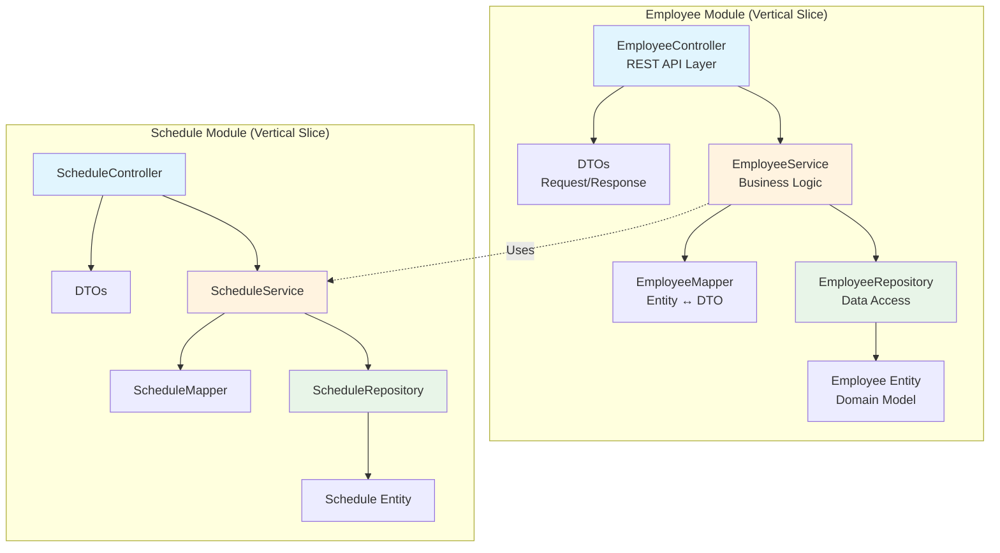
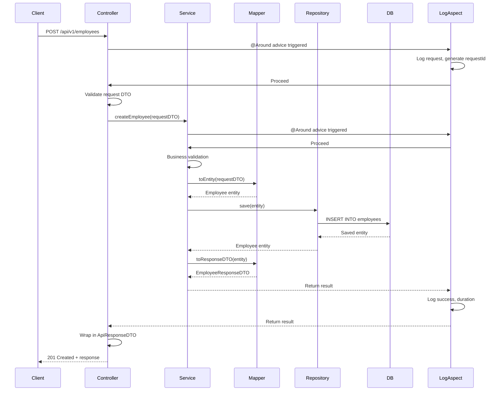
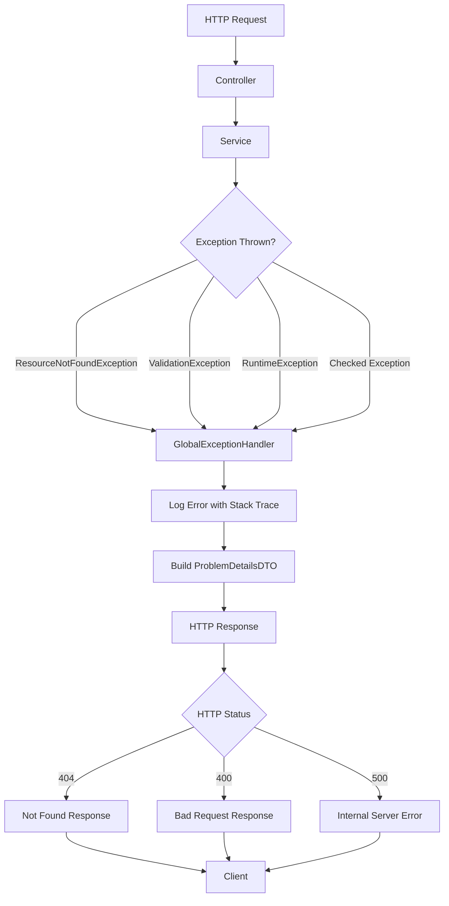
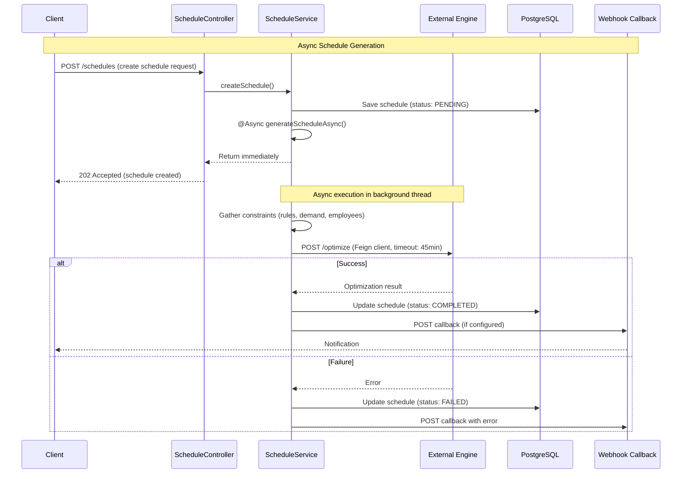
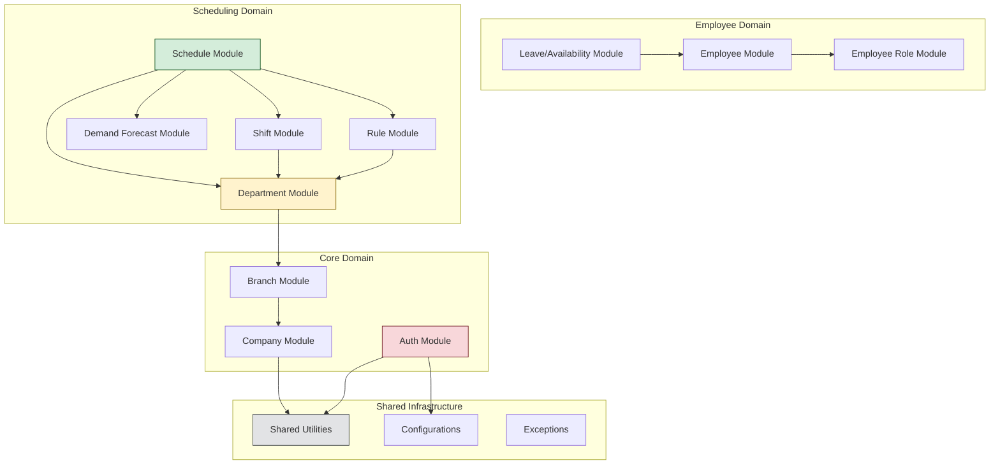

# System Architecture

> **Genesis Workforce Management Platform - System Architecture**

## Table of Contents

* [Overview](02_SYSTEM_ARCHITECTURE.md#overview)
* [System Context](02_SYSTEM_ARCHITECTURE.md#system-context)
* [Application Architecture](02_SYSTEM_ARCHITECTURE.md#application-architecture)
* [Security Architecture](02_SYSTEM_ARCHITECTURE.md#security-architecture)
* [Data Flow Patterns](02_SYSTEM_ARCHITECTURE.md#data-flow-patterns)
* [Async Processing](02_SYSTEM_ARCHITECTURE.md#async-processing)
* [Architectural Decisions](02_SYSTEM_ARCHITECTURE.md#architectural-decisions)

***

## Overview

Genesis is built on **Spring Boot 3.4.0** with **Java 21**, following a **Vertical Slice Architecture** pattern. The system is designed for:

* **Multi-tenancy**: Supporting multiple companies with data isolation
* **Scalability**: Async processing for long-running operations
* **Security**: JWT-based authentication with AWS Cognito
* **Extensibility**: Plugin-like module system for new features

### Core Design Principles

1. **Domain-Driven Design**: Business logic organized by domain modules
2. **API-First**: RESTful APIs with OpenAPI documentation
3. **Security by Default**: All endpoints authenticated unless explicitly public
4. **Observability**: Comprehensive logging with request tracing

***

## System Context

Genesis integrates with several external systems to provide complete workforce management capabilities.


> **Diagram Explanation**: This high-level overview shows the three main tiers of the Genesis ecosystem: **User Roles** (who interacts with the system), the core **Genesis API**, and **External Services** (AWS infrastructure and Schedule Engine) that provide essential capabilities.

### External Dependencies

| System              | Purpose                                       | Protocol         | Notes                      |
| ------------------- | --------------------------------------------- | ---------------- | -------------------------- |
| **AWS Cognito**     | User authentication, user pool management     | AWS SDK          | JWT token provider         |
| **Schedule Engine** | Optimization algorithm for shift scheduling   | REST API (Feign) | Timeout: 45 minutes        |
| **AWS SES**         | Transactional emails (welcome, notifications) | AWS SDK          | Async via SQS              |
| **AWS SQS/SNS**     | Event-driven messaging                        | AWS SDK          | Decouples heavy operations |
| **PostgreSQL**      | Primary data store                            | JDBC             | HikariCP connection pool   |

***

## Application Architecture

### Package Structure

The codebase follows a clean modular structure:

```
com.resetrix.genesis/
├── GenesisApplication.java          # Spring Boot entry point
├── configurations/                   # Spring configuration classes
│   ├── SecurityConfiguration.java   # JWT, CORS, auth rules
│   ├── AsyncConfiguration.java      # Async executor setup
│   ├── FeignConfiguration.java      # HTTP client config
│   ├── DatabaseConfiguration.java   # DataSource, JPA config
│   ├── WebServerConfiguration.java  # TC/Tomcat timeouts
│   └── CognitoConfiguration.java    # AWS Cognito setup
├── modules/                          # Business domain modules
│   ├── auth/                        # Authentication & registration
│   ├── company/                     # Company management
│   ├── branch/                      # Branch management
│   ├── department/                  # Department management
│   ├── employee/                    # Employee CRUD + Cognito sync
│   ├── shift/                       # Shift templates
│   ├── schedule/                    # Schedule generation & approval
│   ├── rule/                        # Business rules engine
│   ├── ruleanswer/                  # Rule answers & configurations
│   ├── demandforecast/              # Demand forecasting
│   ├── employeeleaveavailability/   # Leave requests
│   └── employeerole/                # Role definitions
├── shared/                           # Cross-cutting concerns
│   ├── aspects/                     # AOP logging (LogAspect)
│   ├── constants/                   # Global constants
│   ├── converters/                  # JPA attribute converters
│   ├── dtos/                        # Shared DTOs (ApiResponseDTO)
│   ├── entities/                    # Base entities (BaseEntity)
│   ├── enums/                       # Shared enumerations
│   ├── feign/                       # Feign client interfaces
│   ├── helpers/                     # Utility classes
│   ├── processors/                  # Data processing logic
│   ├── resolvers/                   # Custom argument resolvers
│   ├── securities/                  # JWT validators, converters
│   └── validations/                 # Custom validators
├── exceptions/                       # Exception hierarchy
│   └── handlers/                    # Global exception handlers
└── diagnostics/                      # Health checks, connectivity tests
```

### Vertical Slice Architecture

Each module is a **vertical slice** containing all layers needed for that feature:



> **Diagram Explanation**: Unlike traditional layered architectures (Controller -> Service -> Repository), Vertical Slices group code by **feature**. This diagram illustrates how the 'Employee' and 'Schedule' modules are self-contained with their own full stack of components, promoting modularity and reducing cross-domain coupling.

**Benefits of Vertical Slices:**

* **Cohesion**: All code for a feature is in one place
* **Independence**: Modules can evolve separately
* **Testability**: Each module can be tested in isolation
* **Ownership**: Clear boundaries for team ownership

***

## Security Architecture

### Authentication Flow (AWS Cognito + JWT)


> **Diagram Explanation**: This sequence details the security lifecycle: from **Registration** (creating a Cognito user), to **Confirmation** (verifying email), to **Login** (exchanging credentials for JWTs), and finally making **Authenticated Requests** using the Bearer token.

**Step-by-Step Breakdown:**

1. **Register**: User submits details; API creates a Cognito user (Unconfirmed) and a local Employee record.
2. **Confirm**: User enters the verification code sent to their email to activate their Cognito account.
3. **Login**: User authenticates with email/password and receives JWTs (Access, ID, Refresh).
4. **Access**: User includes the `Access Token` in the Authorization header to call protected API endpoints.

### Security Configuration

The `SecurityConfiguration` class defines:

1. **Public Endpoints** (no authentication required):
   * `/actuator/health` - Health checks
   * `/auth/**` - Registration, login, confirmation
   * `/swagger-ui/**` - API documentation
2. **Protected Endpoints** (JWT required):
   * All other endpoints require valid JWT in `Authorization: Bearer <token>` header
3. **IP Whitelisting**:
   * Engine callback endpoints (`/schedule/update-status`) validate source IP
   * Configured via `ENGINE_ALLOWED_IPS` environment variable
4. **JWT Validation**:
   * Signature verification using Cognito's public keys (JWKS)
   * Expiration check
   * Audience (`aud`) and issuer (`iss`) validation

### Authorization Model


> **Diagram Explanation**: This flow demonstrates how an incoming JWT is processed: validating the signature, extracting claims (User ID, Email, Groups), and populating the Spring Security Context to authorize execution in the Controller and Service layers.

***

## Data Flow Patterns

### Standard CRUD Flow



> **Diagram Explanation**: A standard request lifecycle: The **Controller** validates DTOs, the **Service** applies business logic and uses **Mappers** to convert between DTOs and Entities, while **LogAspect** automatically handles auditing at the boundaries.

**Step-by-Step Breakdown:**

1. **Request**: Client sends data (Payload) to the API Endpoint.
2. **Validation**: Controller validates the input (e.g., checking required fields).
3. **Processing**: Service layer executes business logic and converts DTOs to Entities.
4. **Persistence**: Repository saves the data to the database using Hibernate/JPA.
5. **Response**: The system converts the saved data back to a Response DTO and returns it.

### Error Handling Flow



> **Diagram Explanation**: The centralized exception handling mechanism: All exceptions thrown in the application are caught by the **GlobalExceptionHandler**, which logs the error and converts it into a standardized JSON error response with the appropriate HTTP status code.

***

## Async Processing

Genesis uses Spring's `@Async` for long-running operations, particularly schedule generation.

### Async Configuration

```java
// AsyncConfiguration.java
@Configuration
@EnableAsync
public class AsyncConfiguration {
    @Bean
    public Executor taskExecutor() {
        ThreadPoolTaskExecutor executor = new ThreadPoolTaskExecutor();
        executor.setCorePoolSize(10);
        executor.setMaxPoolSize(20);
        executor.setQueueCapacity(500);
        executor.setThreadNamePrefix("async-");
        executor.initialize();
        return executor;
    }
}
```

### Schedule Generation Flow (Async)



> **Diagram Explanation**: The asynchronous optimization process: A client initiates a request, which immediately returns 'Accepted'. In the background, the service aggregates data, calls the external **Schedule Engine** (with a long timeout), and updates the database upon completion or failure.

**Step-by-Step Breakdown:**

1. **Initiate**: Client requests a schedule. API creates a "PENDING" record and immediately returns `202 Accepted`.
2. **Process**: A background thread gathers necessary data (Employees, Rules, Shifts).
3. **Optimize**: The system calls the external Schedule Engine (up to 45 min wait).
4. **Complete**: Engine returns the result. The system saves the schedule and notifies the user via Webhook.

### Timeout Configuration

For long-running operations, Genesis configures extended timeouts:

```yaml
# application.yaml
server:
  async:
    request-timeout: -1  # No timeout (45 minutes)
  tomcat:
    connection-timeout: 2700000  # 45 minutes
    keep-alive-timeout: 2700000

feign:
  client:
    config:
      engine:
        connectTimeout: 0  # Infinite (45 minutes)
        readTimeout: 0     # Infinite (45 minutes)
        retryer: never     # No retries for idempotency
```

***

## Architectural Decisions

### ADR-001: Vertical Slice Architecture

**Status**: Accepted

**Context**: Traditional layered architecture (Controller → Service → Repository) creates tight coupling across layers and makes it difficult to understand complete features.

**Decision**: Organize code by business features (modules), with each module containing all necessary layers.

**Consequences**:

* ✅ Easier to locate all code for a feature
* ✅ Modules can be developed independently
* ✅ Clearer ownership boundaries
* ❌ Some code duplication across modules
* ❌ Requires discipline to avoid cross-module dependencies

***

### ADR-002: AWS Cognito for Authentication

**Status**: Accepted

**Context**: Need managed authentication with email verification, password reset, and MFA support.

**Decision**: Use AWS Cognito as the identity provider, with JWT tokens for API authentication.

**Consequences**:

* ✅ Managed service (no custom auth logic)
* ✅ Built-in security features (MFA, password policies)
* ✅ Scalable and reliable
* ❌ AWS vendor lock-in
* ❌ Additional cost for Cognito usage

***

### ADR-003: AOP for Cross-Cutting Logging

**Status**: Accepted

**Context**: Need consistent logging across all service and controller methods without manual instrumentation.

**Decision**: Implement `LogAspect` using Spring AOP to automatically log method entry, exit, duration, and errors.

**Consequences**:

* ✅ Consistent logging format
* ✅ No boilerplate in business code
* ✅ Request tracing with MDC
* ❌ Small performance overhead
* ❌ Debugging can be harder (proxy wrapping)

**Implementation**: See `com.resetrix.genesis.shared.aspects.LogAspect`

***

### ADR-004: External Optimization Engine

**Status**: Accepted

**Context**: Schedule optimization is computationally expensive and requires specialized algorithms.

**Decision**: Delegate schedule generation to an external optimization engine via REST API.

**Consequences**:

* ✅ Separation of concerns (API vs. optimization)
* ✅ Can scale optimization independently
* ✅ Easier to swap optimization algorithms
* ❌ Network latency and reliability concerns
* ❌ Need to handle long-running operations (async)

***

### ADR-005: Flyway for Database Migrations

**Status**: Accepted

**Context**: Need version-controlled, repeatable database schema changes.

**Decision**: Use Flyway for all schema migrations with `validate-on-migrate` enabled.

**Consequences**:

* ✅ Version control for database schema
* ✅ Automatic migration on startup
* ✅ Rollback support
* ❌ Requires careful migration script authoring
* ❌ Failed migrations can block startup

**Migration Files**: `src/main/resources/db/migrations/V*.sql`

***

## Next Steps

For implementation details, see:

* [TECHNICAL.md](../compiled/technical_documentation/TECHNICAL.md) - Data models, API patterns, error handling
* [MODULES.md](../compiled/technical_documentation/MODULES.md) - Individual module documentation
* [OPERATIONS.md](../compiled/technical_documentation/OPERATIONS.md) - Deployment and monitoring

***

## 2.5 Module Dependencies

The following diagram illustrates the verified dependency graph between the core modules, derived from the codebase structure:



> **Diagram Notes**:
>
> * **Schedule Module**: Orchestrates the scheduling process, pulling data from Shifts, Forecasts, and Rules.
> * **Core Hierarchy**: Enforces the strict `Company -> Branch -> Department` organizational structure.
> * **Shared Layer**: Provides cross-cutting utilities (Exceptions, Constants, AOP Aspects) used by valid feature modules.
