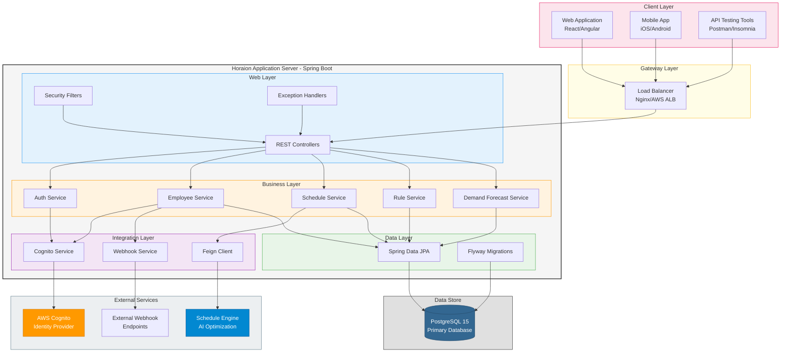
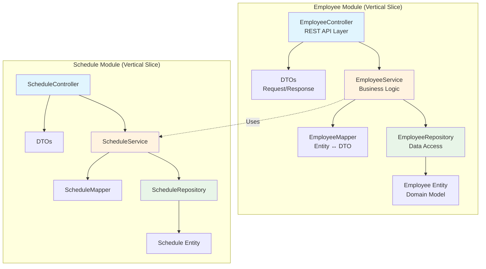
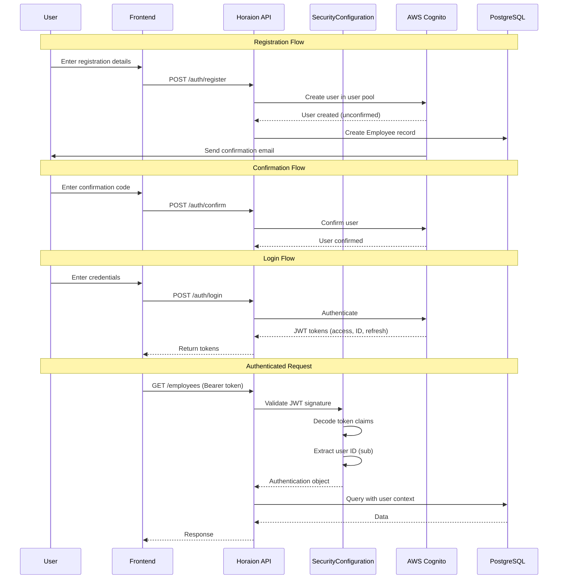
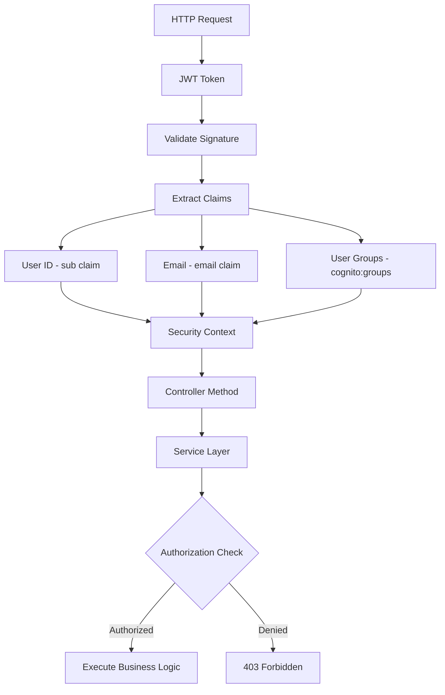
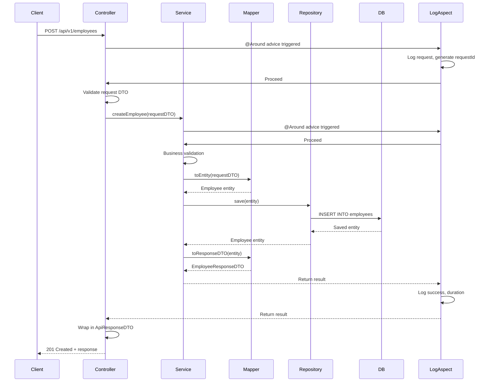
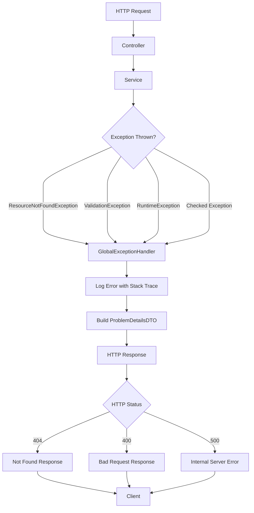
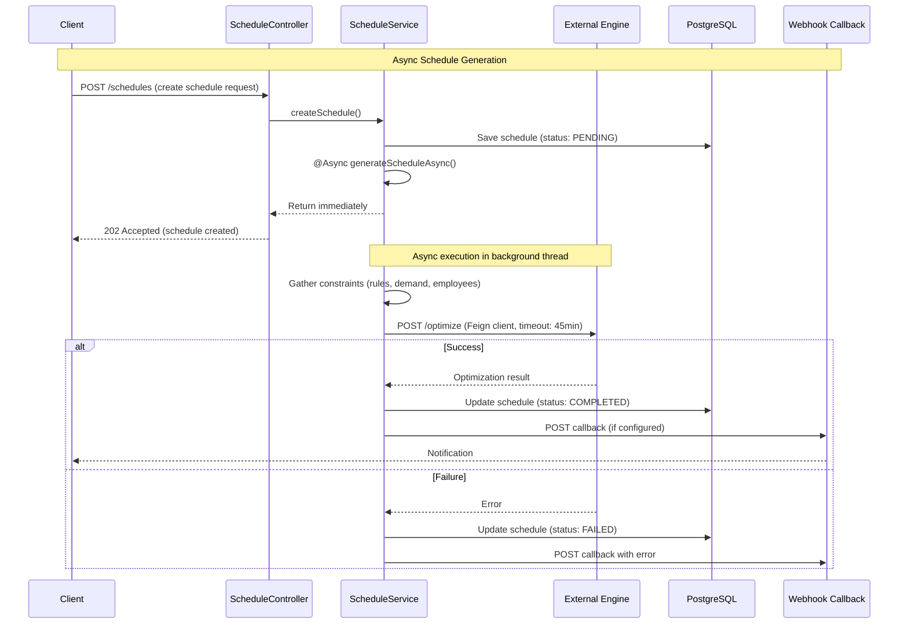
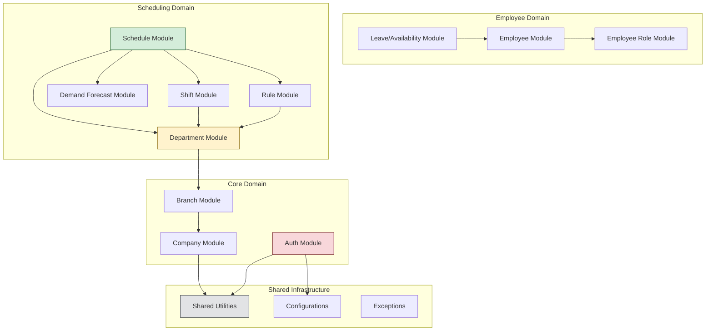

# System Architecture

> **Horaion Workforce Management Platform - System Architecture**

## Table of Contents

* [Overview](02_SYSTEM_ARCHITECTURE.md#overview)
* [System Context](02_SYSTEM_ARCHITECTURE.md#system-context)
* [Application Architecture](02_SYSTEM_ARCHITECTURE.md#application-architecture)
* [Security Architecture](02_SYSTEM_ARCHITECTURE.md#security-architecture)
* [Data Flow Patterns](02_SYSTEM_ARCHITECTURE.md#data-flow-patterns)
* [Async Processing](02_SYSTEM_ARCHITECTURE.md#async-processing)
* [Architectural Decisions](02_SYSTEM_ARCHITECTURE.md#architectural-decisions)

***

## Overview

Horaion is built on **Spring Boot 4.0.0** with **Java 21**, following a **Vertical Slice Architecture** pattern. The system is designed for high reliability, strict data isolation, and performance.


**Note:** The system follows the **Vertical Slice Architecture** pattern, which favors cohesion over generic layers. Each "slice" contains all code necessary for a specific feature, from API controllers to database repositories.


* **Multi-tenancy**: Supporting multiple companies with strict logical data isolation.
* **Scalability**: Asynchronous processing and non-blocking I/O for long-running operations.
* **Security**: Enterprise-grade JWT authentication via AWS Cognito.
* **Extensibility**: Modular shared kernel and vertical slices for rapid feature development.

### Core Design Principles

1. **Domain-Driven Design**: Business logic is organized around business entities rather than technical layers.
2. **API-First**: All functionality is exposed via standardized RESTful APIs with strict contracts.
3. **Security by Default**: Zero-trust approach; all endpoints require explicit authorization.
4. **Observability**: Distributed tracing and centralized logging for all requests.

***

## System Context

Horaion operates as a centralized orchestrator, integrating with specialized external providers to deliver a comprehensive workforce management experience.


**Success:** This decoupled architecture allows individual components (like the Schedule Engine) to be scaled or replaced without affecting the core platform.




> **Diagram Explanation**: This high-level overview shows the three main tiers of the Horaion ecosystem.

**How to Read This Diagram**:

* **Top (Pink)**: The **Client Layer** is where users like you sit. You use the Web or Mobile app.
* **Middle (Yellow/White)**: The **Gateway** and **Application Server** are "Horaion" itself. The Gateway directs traffic, and the App Server does the thinking.
* **Bottom/Right (Grey/Blue)**: The **Data** and **External Services** are where information lives or where we ask for help (like AWS).

**Component Breakdown**:

1. **Client Layer (The User's Device)**:
   * **Web App**: The React application used by employees and managers.
   * **Mobile App**: Native apps for on-the-go access.
   * **Tools**: Postman/Insomnia used by developers to test the API directly.
2. **Gateway Layer (The Traffic Cop)**:
   * **Load Balancer**: The entry point that distributes traffic, ensuring no single server is overwhelmed.
3. **Application Server (The Core)**:
   * **Web Layer**: Receives the request, checks security (Filters), and routes it to the right controller.
   * **Business Layer**: The actual logic (e.g., "Calculate Demand", "Approve Schedule").
   * **Integration Layer**: Helpers that talk to the outside world (Cognito, Webhooks).
   * **Data Layer**: Translates Java objects into SQL queries for the database.
4. **External Services**: Dependencies we don't host ourselves (AWS for auth, AI Engine for math).

### Request Lifecycle Flow (Follow the Arrows)

The diagram arrows show how a request travels through the system:

1. **Client Initiation**: The client (Web or Mobile) transmits a secure HTTP request (`POST /approve`) -> **Load Balancer**.
2. **Gateway Routing**: **Load Balancer** -> **Controllers** (inside the App Server).
3. **Security Verification**: **Controllers** use **Filters** to valid the user.
4. **Business Processing**: **Controllers** -> **Business Services** (e.g., Schedule Service) -> **Integration/Data Layers**.
5. **External Calls**: If needed, **Integration Layer** -> **External Services** (e.g., AWS).
6. **Response**: The path reverses to send the answer back to you.

### External Dependencies

| System              | Purpose                                       | Protocol         | Notes                      |
| ------------------- | --------------------------------------------- | ---------------- | -------------------------- |
| **AWS Cognito**     | User authentication, user pool management     | AWS SDK          | JWT token provider         |
| **Schedule Engine** | Optimization algorithm for shift scheduling   | REST API (Feign) | Timeout: 45 minutes        |
| **AWS SES**         | Transactional emails (welcome, notifications) | AWS SDK          | Async via SQS              |
| **AWS SQS/SNS**     | Event-driven messaging                        | AWS SDK          | Decouples heavy operations |
| **PostgreSQL**      | Primary data store                            | JDBC             | HikariCP connection pool   |

***

## Application Architecture

### Package Structure

The codebase follows a clean modular structure, ensuring that business logic is separated from cross-cutting concerns.


**Note:** The root package is `com.horaion.app`. All business functionality is grouped within the `modules/` package, while system-level infrastructure resides in `shared/`.


```
com.horaion.app/
├── HoraionApplication.java           # Spring Boot entry point
├── modules/                          # Business domain modules
│   ├── auth/                        # Authentication & registration
│   ├── branch/                      # Branch management
│   ├── company/                     # Company management
│   ├── demandforecast/              # Demand forecasting
│   ├── department/                  # Department management
│   ├── employee/                    # Employee management
│   ├── employeeleaveavailability/   # Leave requests & availability
│   ├── jobtitle/                    # Job title management
│   ├── me/                          # User self-management
│   ├── rule/                        # Business rules engine
│   ├── schedule/                    # Schedule generation & approval
│   └── shift/                       # Shift templates & management
├── shared/                           # Cross-cutting concerns
│   ├── core/                        # Core utilities and base classes
│   ├── database/                    # Database configurations & Base Entities
│   ├── infrastructure/              # Infrastructure concerns (AWS, Engine)
│   ├── logging/                     # Logging configurations & Aspects
│   ├── metrics/                     # Application metrics
│   ├── providers/                   # External service providers
│   ├── resolvers/                   # Custom argument resolvers
│   └── security/                    # Security configurations & JWT
└── resources/                        # Persistence resources
    └── db/
        └── migration/               # Flyway schema evolution scripts
```


**Tip:** When adding a new feature, start by creating a new package under `modules/`. This preserves the Vertical Slice integrity and makes the feature easier to maintain.


### Vertical Slice Architecture

Each module is a **vertical slice** containing all layers needed for that feature, eliminating the need to navigate across disparate layers for a single business operation.


**Important:** Avoid deep cross-module dependencies. If Module A needs data from Module B, consider using a shared DTO or a lightweight service call rather than directly accessing Module B's internal entities.




> **Diagram Explanation**: Unlike traditional layered architectures (Controller -> Service -> Repository), Vertical Slices group code by **feature**. This keeps related code together.

**Architectural Analysis**:

1. **Feature Boundaries**: The blue boxes represent functional boundaries. All logic for "Employees" is encapsulated within its own slice.
2. **Layered Responsibility**: Each slice still maintains internal separation (Controller for HTTP, Service for Logic, Repository for DB), but these layers are private to the slice.
3. **Low Coupling**: The thin dotted line represents the only interaction point between modules, minimizing the ripple effect of changes.

**Strategic Benefits of Vertical Slices:**

* **High Cohesion**: Changes to a specific business rule only affect one package.
* **Rapid Onboarding**: New developers only need to understand one module to start contributing.
* **Testability**: Features can be verified in isolation with minimal mocking of external layers.
* **Deployment Readiness**: The structure simplifies a future migration to microservices if required.

***

## Security Architecture

### Authentication Flow (AWS Cognito + JWT)



```mermaid
> **Diagram Explanation**: This sequence details the security lifecycle: from **Registration**, to **Confirmation**, and finally **Login**.
```


**Critical:** The registration flow creates local `Employee` records _before_ Cognito confirmation. Ensure your cleanup jobs handle unconfirmed accounts older than 24 hours to prevent data clutter.


```markdown
**Step-by-Step Flow**:
1.  **Registration**:
    *   User enters details -> API creates a "pending" user in AWS Cognito.
    *   AWS Cognito sends a real email to the user with a code.
    *   **Local Persistence**: A record is created in the `Employee` table linked by email.
2.  **Confirmation**:
    *   User enters the code -> API tells Cognito to "verify" the user.
    *   Once confirmed, the user is authorized to attempt their first login.
3.  **Login**:
    *   User sends Email/Password -> API forwards this to Cognito via the AWS SDK.
    *   Cognito checks the password -> returns a set of **JWT Tokens** (Access, ID, Refresh).
    *   API returns these to the Frontend for storage.
4.  **Authenticated Request**:
    *   For all future requests (like "Get Employees"), the Frontend attaches the Access Token in the `Authorization` header.
    *   The API validates the JWT signature against Cognito's public keys before processing.
```


**Note:** Access tokens are short-lived (typically 1 hour). The Frontend should use the `Refresh Token` to obtain new `Access Tokens` without forcing the user to re-login.


#### Security Configuration

1. **Public Endpoints** (no authentication required): \*

* &#x20;`/actuator/health` - Health checks
* `/auth/**` - Registration, login, confirmation
* `/swagger-ui/**` - API documentation&#x20;

2. **Protected Endpoints** (JWT required):

* All other endpoints require valid JWT in `Authorization: Bearer <token>` header

3. **IP Whitelisting**:

* Engine callback endpoints (`/schedule/update-status`) validate source IP
* Configured via `ENGINE_ALLOWED_IPS` environment variable&#x20;

4. **JWT Validation**:&#x20;

* Signature verification using Cognito's public keys (JWKS)
* Expiration check
* Audience (`aud`) and issuer (`iss`) validation

#### Authorization Model




> **Diagram Explanation**: This flow demonstrates how an incoming JWT is processed to decide "Is this user allowed in?".

**Authentication Logic**:

1. **Incoming Request**: Arrives with a header `Authorization: Bearer <token>`.
2. **Validate Signature**: The system checks the mathematical signature of the token against AWS's public key. If modified, it rejects it immediately.
3. **Extract Claims**: It opens the token to read:
   * **Sub**: The User ID.
   * **Email**: Who they are.
   * **Groups**: Are they an Admin? A Manager?
4. **Security Context**: These details are stored in the temporary memory (`SecurityContext`) for the duration of the request so the Controller knows who is calling it.

***

## Data Flow Patterns

### Standard CRUD Flow



> **Diagram Explanation**: A standard request lifecycle for saving data (e.g., "Create Employee").

**Step-by-Step Flow**:

1. **API Entry**: Client sends a POST request. The **Controller** receives it.
2. **Validation**: Controller checks "Is the email valid? Is the name empty?".
3. **Service Processing**:
   * **LogAspect**: Automatically records "User X started Create Employee".
   * **Mapper**: Converts the JSON input (DTO) into a Database Object (Entity).
   * **Repository**: Saves the Entity to the database (`INSERT`).
4. **Completion**:
   * The Service takes the saved data, converts it back to JSON (Response DTO), and returns it.
   * **LogAspect**: Records "User X finished in 50ms".

**Step-by-Step Breakdown:**

1. **Request**: Client sends data (Payload) to the API Endpoint.
2. **Validation**: Controller validates the input (e.g., checking required fields).
3. **Processing**: Service layer executes business logic and converts DTOs to Entities.
4. **Persistence**: Repository saves the data to the database using Hibernate/JPA.
5. **Response**: The system converts the saved data back to a Response DTO and returns it.

### Error Handling Flow



> **Diagram Explanation**: The centralized exception handling mechanism. It acts as a safety net for the whole application.

**How it Works**:

1. **Something Goes Wrong**: A bug occurs, or a user asks for ID 999 (which doesn't exist). An `Exception` is thrown.
2. **Global Handler Catches It**: Instead of crashing or showing a raw stack trace, the `GlobalExceptionHandler` typically intercepts it.
3. **Categorization**:
   * **ResourceNotFound**: Becomes a `404 Not Found`.
   * **ValidationException**: Becomes a `400 Bad Request`.
   * **RuntimeException**: Becomes a `500 Server Error`.
4. **Response**: The user gets a clean JSON error message explaining exactly what went wrong.

***

## Async Processing

Horaion uses Spring's `@Async` for long-running operations, particularly schedule generation.

### Async Configuration

```java
// AsyncConfiguration.java
@Configuration
@EnableAsync
public class AsyncConfiguration {
    @Bean
    public Executor taskExecutor() {
        ThreadPoolTaskExecutor executor = new ThreadPoolTaskExecutor();
        executor.setCorePoolSize(10);
        executor.setMaxPoolSize(20);
        executor.setQueueCapacity(500);
        executor.setThreadNamePrefix("async-");
        executor.initialize();
        return executor;
    }
}
```

### Schedule Generation Flow (Async)



> **Diagram Explanation**: The asynchronous optimization process. This allows the system to do "heavy lifting" (math) without making the user wait.

**Step-by-Step Flow**:

1. **Initiate (The Hand-off)**: User clicks "Create Schedule". The system creates a placeholder record ("PENDING") and _immediately_ says "OK, we're working on it" (202 Accepted).
2. **Background Work**:
   * A hidden background thread wakes up.
   * It grabs all the necessary data (Rules, Shifts, People).
3. **External Engine**:
   * This thread sends the problem to the **Schedule Engine** (a separate heavy-duty calculator).
   * It waits patiently (up to 45 mins) _without_ blocking the main web server.
4. **Completion**:
   * The Engine replies.
   * The thread wakes up, saves the result to the DB, and marks the schedule "COMPLETED".
5. **Notification**: A webhook or email tells the user "Your schedule is ready!".

**Step-by-Step Breakdown:**

1. **Initiate**: Client requests a schedule. API creates a "PENDING" record and immediately returns `202 Accepted`.
2. **Process**: A background thread gathers necessary data (Employees, Rules, Shifts).
3. **Optimize**: The system calls the external Schedule Engine (up to 45 min wait).
4. **Complete**: Engine returns the result. The system saves the schedule and notifies the user via Webhook.


**Important:** The system is explicitly configured for long-running operations. Standard Tomcat/Feign timeouts are bypassed to support the 15-30 minute generation window required by the optimization engine.


### Timeout Configuration

For long-running operations, Horaion configures extended timeouts:

```yaml
# application.yaml
server:
  async:
    request-timeout: -1  # Disable timeout for async processing
  tomcat:
    connection-timeout: 2700000  # 45 minutes
    keep-alive-timeout: 2700000

feign:
  client:
    config:
      engine:
        connectTimeout: 0  # Support long-tail connections
        readTimeout: 0     # Support long-tail connections
        retryer: never     # Idempotency safety: No automatic retries
```


**Critical:** Setting infinite or very high timeouts (`2700000ms`) can lead to resource exhaustion if too many concurrent requests are made. The `ThreadPoolTaskExecutor` core pool size (10) acts as the primary governor for concurrency.


***

## Architectural Decisions

### ADR-001: Vertical Slice Architecture

**Status**: Accepted

**Context**: Traditional layered architecture (Controller → Service → Repository) creates tight coupling across layers and makes it difficult to understand complete features.

**Decision**: Organize code by business features (modules), with each module containing all necessary layers.

**Consequences**:

* ✅ Easier to locate all code for a feature
* ✅ Modules can be developed independently
* ✅ Clearer ownership boundaries
* ❌ Some code duplication across modules
* ❌ Requires discipline to avoid cross-module dependencies

***

### ADR-002: AWS Cognito for Authentication

**Status**: Accepted

**Context**: Need managed authentication with email verification, password reset, and MFA support.

**Decision**: Use AWS Cognito as the identity provider, with JWT tokens for API authentication.

**Consequences**:

* ✅ Managed service (no custom auth logic)
* ✅ Built-in security features (MFA, password policies)
* ✅ Scalable and reliable
* ❌ AWS vendor lock-in
* ❌ Additional cost for Cognito usage

***

### ADR-003: AOP for Cross-Cutting Logging

**Status**: Accepted

**Context**: Need consistent logging across all service and controller methods without manual instrumentation.

**Decision**: Implement `LogAspect` using Spring AOP to automatically log method entry, exit, duration, and errors.

**Consequences**:

* ✅ Consistent logging format
* ✅ No boilerplate in business code
* ✅ Request tracing with MDC
* ❌ Small performance overhead
* ❌ Debugging can be harder (proxy wrapping)

**Implementation**: See `com.horaion.app.shared.logging.LogAspect`

***

### ADR-004: External Optimization Engine

**Status**: Accepted

**Context**: Schedule optimization is computationally expensive and requires specialized algorithms.

**Decision**: Delegate schedule generation to an external optimization engine via REST API.

**Consequences**:

* ✅ Separation of concerns (API vs. optimization)
* ✅ Can scale optimization independently
* ✅ Easier to swap optimization algorithms
* ❌ Network latency and reliability concerns
* ❌ Need to handle long-running operations (async)

***

### ADR-005: Flyway for Database Migrations

**Status**: Accepted

**Context**: Need version-controlled, repeatable database schema changes.

**Decision**: Use Flyway for all schema migrations with `validate-on-migrate` enabled.

**Consequences**:

* ✅ Version control for database schema
* ✅ Automatic migration on startup
* ✅ Rollback support
* ❌ Requires careful migration script authoring
* ❌ Failed migrations can block startup

**Migration Files**: `src/main/resources/db/migrations/V*.sql`

***

## Next Steps

For implementation details, see:

* [TECHNICAL.md](../compiled/technical_documentation/TECHNICAL.md) - Data models, API patterns, error handling
* [MODULES.md](../compiled/technical_documentation/MODULES.md) - Individual module documentation
* [OPERATIONS.md](../compiled/technical_documentation/OPERATIONS.md) - Deployment and monitoring

***

## 2.5 Module Dependencies

The following diagram illustrates the verified dependency graph between the core modules, derived from the codebase structure:



> **Diagram Explanations**: This dependency graph shows the "Rules of Engagement" between modules.

**Understanding the Arrows**:

* **Arrow Direction**: `A --> B` means "Module A needs Module B to work".
* **Core Hierarchy**:
  * **Department** depends on **Branch**, which depends on **Company**. You cannot have a Department without a Branch.
* **Scheduling Domain**:
  * **Schedule Module** is the "Conductor". It pulls data from **Shifts**, **Forecasts**, and **Rules** to build the roster.
* **Shared Layer**:
  * Everything depends on **Shared Utilities** (bottom grey box). This is where common code lives so we don't repeat ourselves.
