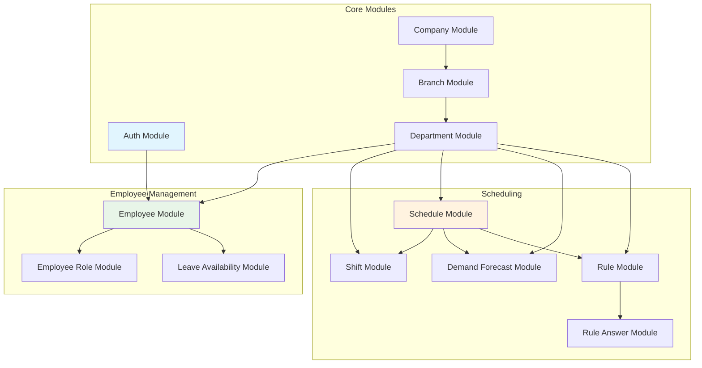
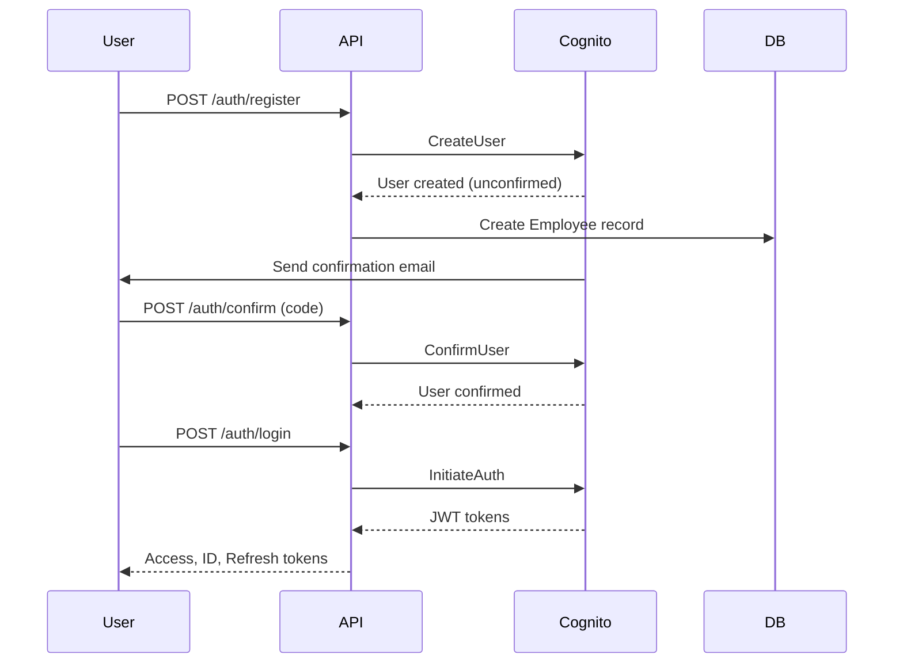
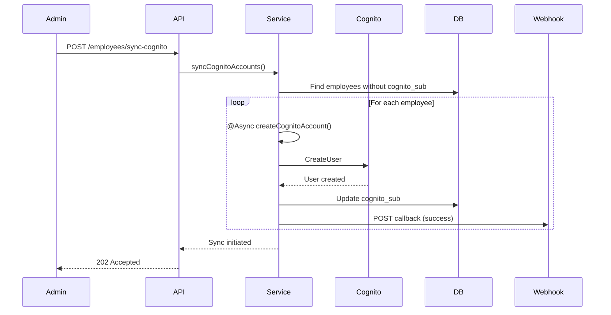
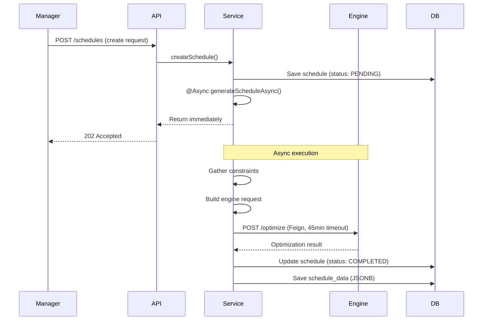
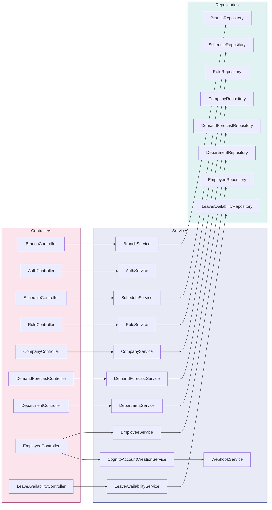

# Module Reference

> **Genesis Workforce Management Platform - Backend Specifications**

## Table of Contents
- [Overview](#overview)
- [Module Catalog](#module-catalog)
- [Module Details](#module-details)
- [Inter-Module Communication](#inter-module-communication)

---

## Overview

Genesis follows **Vertical Slice Architecture**, where each module is a self-contained feature with its own:
- **Controllers**: REST API endpoints
- **Services**: Business logic
- **Repositories**: Data access
- **Entities**: JPA domain models
- **DTOs**: Request/Response data transfer objects
- **Mappers**: Entity ↔ DTO conversion
- **Exceptions**: Domain-specific errors

### Module Structure

```
modules/{module-name}/
├── {ModuleName}Controller.java      # REST endpoints
├── {ModuleName}Service.java         # Business logic implementation
├── I{ModuleName}Service.java        # Service interface
├── {ModuleName}Repository.java      # Spring Data JPA repository
├── {ModuleName}Mapper.java          # Orika/MapStruct mapper
├── dto/
│   ├── {ModuleName}RequestDTO.java  # Request payload
│   └── {ModuleName}ResponseDTO.java # Response payload
├── entity/
│   └── {ModuleName}.java            # JPA entity
└── exceptions/
    └── {ModuleName}Exception.java   # Custom exceptions
```

---

## Module Catalog



> **Diagram Explanation**: A dependency graph showing the relationship between core modules.

**Architecture Tiers**:
1.  **Core Modules (Blue)**: The foundation. `Company`, `Branch`, and `Auth` set up the structure of the system.
2.  **Employee Attributes (Green)**: Personnel details. `Employees` have `Roles` and `Leave`.
3.  **Scheduling (Orange)**: The most complex layer. `Schedules` depend on *everything below them* (Employees, Shifts, Rules, Forecasts).


| Module | Package | Primary Entity | Key Endpoints |
|--------|---------|----------------|---------------|
| **Auth** | `modules.auth` | N/A (Cognito) | `/auth/register`, `/auth/login`, `/auth/confirm` |
| **Company** | `modules.company` | `Company` | `/api/v1/companies` |
| **Branch** | `modules.branch` | `Branch` | `/api/v1/branches` |
| **Department** | `modules.department` | `Department` | `/api/v1/departments` |
| **Employee** | `modules.employee` | `Employee` | `/api/v1/employees` |
| **Employee Role** | `modules.employeerole` | `EmployeeRole` | `/api/v1/employee-roles` |
| **Shift** | `modules.shift` | `Shift` | `/api/v1/shifts` |
| **Schedule** | `modules.schedule` | `Schedule` | `/api/v1/schedules` |
| **Demand Forecast** | `modules.demandforecast` | `DemandForecast` | `/api/v1/demand-forecasts` |
| **Rule** | `modules.rule` | `Rule` | `/api/v1/rules` |
| **Rule Answer** | `modules.ruleanswer` | `RuleAnswer` | `/api/v1/rule-answers` |
| **Leave Availability** | `modules.employeeleaveavailability` | `EmployeeLeaveAvailability` | `/api/v1/leave-requests` |

---

## Module Details

### 1. Auth Module

**Purpose**: User authentication and registration using AWS Cognito.

**Key Features**:
- User registration with email verification
- Login with JWT token generation
- Password reset and change
- Email confirmation flow

**Key Endpoints**:
```
POST /auth/register          # Create new user in Cognito + Employee record
POST /auth/confirm           # Confirm email with verification code
POST /auth/login             # Authenticate and get JWT tokens
POST /auth/forgot-password   # Initiate password reset
POST /auth/reset-password    # Complete password reset
POST /auth/change-password   # Change password for authenticated user
```

**Authentication Flow**:


> **Diagram Explanation**: The handshake between the User, our API, and AWS Cognito.

**Interactive Steps**:
1.  **Register**: User asks API to sign up. API forwards this to Cognito.
2.  **Confirm**: Cognito sends a code to User's email. User enters this code to prove ownership.
3.  **Login**: User sends password. API checks with Cognito. Cognito returns the keys (JWT Tokens) to access the system.


**Special Considerations**:
- `cognito_sub` in Employee table links to Cognito user
- Supports bulk employee creation with async Cognito account creation
- Webhook callbacks for Cognito account creation status

---

### 2. Company Module

**Purpose**: Root of the multi-tenant hierarchy.

**Key Features**:
- Company registration
- Onboarding status tracking
- Company-level settings

**Key Endpoints**:
```
GET    /api/v1/companies              # List all companies (paginated)
GET    /api/v1/companies/{id}         # Get company by ID
POST   /api/v1/companies              # Create new company
PUT    /api/v1/companies/{id}         # Update company
DELETE /api/v1/companies/{id}         # Soft delete company
```

**Business Rules**:
- `registration_number` must be unique
- Deleting a company soft-deletes all child branches and departments

---

### 3. Branch Module

**Purpose**: Physical or logical locations within a company.

**Key Features**:
- Branch management
- Branch type categorization (HEADQUARTERS, RETAIL, etc.)
- Geographic location tracking

**Key Endpoints**:
```
GET    /api/v1/branches                    # List all branches
GET    /api/v1/branches/{id}               # Get branch by ID
GET    /api/v1/companies/{companyId}/branches  # Get branches for company
POST   /api/v1/branches                    # Create new branch
PUT    /api/v1/branches/{id}               # Update branch
DELETE /api/v1/branches/{id}               # Soft delete branch
```

---

### 4. Department Module

**Purpose**: Organizational units within branches. Primary scheduling scope.

**Key Features**:
- Department hierarchy
- Head of department assignment
- Department-level budgeting

**Key Endpoints**:
```
GET    /api/v1/departments                 # List all departments
GET    /api/v1/departments/{id}            # Get department by ID
GET    /api/v1/branches/{branchId}/departments  # Get departments for branch
POST   /api/v1/departments                 # Create new department
PUT    /api/v1/departments/{id}            # Update department
DELETE /api/v1/departments/{id}            # Soft delete department
```

**Business Rules**:
- `head_of_dept_id` must reference an active employee
- Department code must be unique within a branch

---

### 5. Employee Module

**Purpose**: Staff member management with Cognito integration.

**Key Features**:
- CRUD operations for employees
- Bulk import via Excel upload
- Cognito account synchronization
- Phone number normalization
- Custom fields via JSONB

**Key Endpoints**:
```
GET    /api/v1/employees                   # List all employees (paginated)
GET    /api/v1/employees/{id}              # Get employee by ID
GET    /api/v1/employees/code/{code}       # Get employee by employee code
GET    /api/v1/departments/{deptId}/employees  # Get employees for department
POST   /api/v1/employees                   # Create new employee
PUT    /api/v1/employees/{id}              # Update employee
DELETE /api/v1/employees/{id}              # Soft delete employee
POST   /api/v1/employees/upload            # Bulk import from Excel
GET    /api/v1/employees/template          # Download Excel template
POST   /api/v1/employees/sync-cognito      # Sync Cognito accounts for all employees
POST   /api/v1/employees/{id}/create-cognito  # Create Cognito account for one employee
```

**Special Features**:
- **Excel Import**: Upload `.xlsx` file to bulk create employees
- **Async Cognito Creation**: Uses `@Async` to create Cognito accounts in background
- **Webhook Callbacks**: Notifies external systems when Cognito accounts are created
- **Phone Normalization**: Automatically formats phone numbers to E.164 format

**Cognito Sync Flow**:


> **Diagram Explanation**: The bulk synchronization process. Ensuring everyone in the database has a login.

**Process Flow**:
1.  **Trigger**: Admin clicks "Sync".
2.  **Search**: System finds employees who have a record but no login account (`cognito_sub` is missing).
3.  **Loop**: For each missing one, it creates a Cognito account in the background.
4.  **Feedback**: It updates the database and fires a webhook to let us know it's done.


---

### 6. Schedule Module

**Purpose**: Schedule generation and approval workflow.

**Key Features**:
- Schedule creation and management
- Integration with external optimization engine
- Approval workflow (PENDING → PROCESSING → COMPLETED → APPROVED)
- Async schedule generation

**Key Endpoints**:
```
GET    /api/v1/schedules                   # List all schedules
GET    /api/v1/schedules/{id}              # Get schedule by ID
GET    /api/v1/schedules/{id}/data         # Get schedule data (full result)
POST   /api/v1/schedules                   # Create and generate schedule
PUT    /api/v1/schedules/{id}              # Update schedule
POST   /api/v1/schedules/{id}/approve      # Approve schedule
POST   /api/v1/schedules/{id}/reject       # Reject schedule
DELETE /api/v1/schedules/{id}              # Delete schedule
```

**Schedule Generation Flow**:


> **Diagram Explanation**: The critical async hand-off.

**Logic Breakdown**:
1.  **User Request**: "Please build the schedule."
2.  **Immediate Reply**: The system doesn't wait. It replies "Accepted (202)" instantly so the browser doesn't freeze.
3.  **Background Work**: A hidden worker gathers all the data (Shifts, Rules).
4.  **Long Wait**: The worker talks to the Engine. This can take 45 minutes.
5.  **Finish**: When done, the worker saves the result to the DB silently.


**Status Lifecycle**:
- `PENDING`: Schedule created, not yet sent to engine
- `PROCESSING`: Sent to optimization engine
- `COMPLETED`: Engine returned result
- `FAILED`: Engine error or timeout
- `APPROVED`: Manager approved
- `REJECTED`: Manager rejected

---

### 7. Shift Module

**Purpose**: Define shift templates and time blocks.

**Key Features**:
- Shift template management
- Time block configuration
- Shift type categorization

**Key Endpoints**:
```
GET    /api/v1/shifts                      # List all shifts
GET    /api/v1/shifts/{id}                 # Get shift by ID
POST   /api/v1/shifts                      # Create new shift
PUT    /api/v1/shifts/{id}                 # Update shift
DELETE /api/v1/shifts/{id}                 # Delete shift
```

**Shift Structure**:
```json
{
  "id": 1,
  "shiftName": "Morning Shift",
  "shiftType": "FULL_TIME",
  "timeBlocks": [
    {"start": "09:00", "end": "13:00"},
    {"start": "14:00": "end": "18:00"}
  ]
}
```

---

### 8. Demand Forecast Module

**Purpose**: Predict staffing requirements.

**Key Features**:
- Role-based demand forecasting
- Date range planning
- Historical data analysis

**Key Endpoints**:
```
GET    /api/v1/demand-forecasts            # List all forecasts
GET    /api/v1/demand-forecasts/{id}       # Get forecast by ID
POST   /api/v1/demand-forecasts            # Create new forecast
PUT    /api/v1/demand-forecasts/{id}       # Update forecast
DELETE /api/v1/demand-forecasts/{id}       # Delete forecast
```

---

### 9. Rule Module

**Purpose**: Configure scheduling constraints and business rules.

**Key Features**:
- Template-based rule system
- Provider-specific rule configurations
- Field-level customization

**Key Endpoints**:
```
GET    /api/v1/rules                       # List all rules
GET    /api/v1/rules/{id}                  # Get rule by ID
POST   /api/v1/rules                       # Create new rule
PUT    /api/v1/rules/{id}                  # Update rule
DELETE /api/v1/rules/{id}                  # Delete rule
```

**Rule Examples**:
- Minimum rest period between shifts
- Maximum consecutive working days
- Skill-based shift assignments
- Fairness constraints (equal distribution)

---

### 10. Leave Availability Module

**Purpose**: Employee leave request management.

**Key Features**:
- Leave request submission
- Approval workflow
- Leave balance tracking

**Key Endpoints**:
```
GET    /api/v1/leave-requests              # List all leave requests
GET    /api/v1/leave-requests/{id}         # Get leave request by ID
POST   /api/v1/leave-requests              # Submit new leave request
PUT    /api/v1/leave-requests/{id}/approve # Approve leave request
PUT    /api/v1/leave-requests/{id}/reject  # Reject leave request
DELETE /api/v1/leave-requests/{id}         # Cancel leave request
```

---


## 8. Layered Architecture

The following diagram illustrates the verified flow from **Controllers** to **Services** to **Repositories**, including special handling for Authentication and Employee creation.



> **Diagram Explanation**: The verified flow of data through the code.

**Role Breakdown**:
*   **Controller (Pink)**: "The Receptionist". Takes the input, checks validity.
*   **Service (Blue)**: "The Manager". Does the actual thinking and logic.
*   **Repository (Green)**: "The Archivist". Puts files in the cabinet (Database).
*   **Special Cases**: `AuthService` doesn't have a Repository because it talks to AWS, not our DB. `EmployeeService` does both (DB + AWS).

---

## Inter-Module Communication

### Direct Service Calls

Modules can call other module services directly:

```java
@Service
public class ScheduleService {
    private final EmployeeService employeeService;
    private final ShiftService shiftService;
    private final RuleService ruleService;
    
    public void generateSchedule(Long departmentId) {
        // Get employees from Employee module
        List<Employee> employees = employeeService.getActiveEmployeesByDepartment(departmentId);
        
        // Get shifts from Shift module
        List<Shift> shifts = shiftService.getShiftsByDepartment(departmentId);
        
        // Get rules from Rule module
        List<Rule> rules = ruleService.getRulesByDepartment(departmentId);
        
        // Generate schedule...
    }
}
```

### Event-Driven Communication

For decoupled communication, modules can publish events:

```java
// Employee module publishes event
applicationEventPublisher.publishEvent(new EmployeeCreatedEvent(employee));

// Schedule module listens
@EventListener
public void onEmployeeCreated(EmployeeCreatedEvent event) {
    // Update schedule availability
}
```

---

## Best Practices

1. **Keep modules independent**: Avoid tight coupling between modules
2. **Use service interfaces**: Program to interfaces, not implementations
3. **Validate at boundaries**: Validate input at controller and service layers
4. **Use DTOs**: Never expose entities directly in API responses
5. **Handle errors gracefully**: Use domain-specific exceptions
6. **Log comprehensively**: LogAspect handles this automatically
7. **Test in isolation**: Each module should have its own test suite

---

## Next Steps

- [TECHNICAL.md](TECHNICAL.md) - Data models and API standards
- [OPERATIONS.md](OPERATIONS.md) - Deployment and configuration
- [ARCHITECTURE.md](ARCHITECTURE.md) - System design patterns

## Advanced Module Patterns

### Module Communication Strategies

#### Direct Service Injection

**Pattern**: Modules communicate through direct service dependencies.

```java
@Service
public class ScheduleService {
    
    private final EmployeeService employeeService;
    private final ShiftService shiftService;
    private final RuleService ruleService;
    private final DemandForecastService demandForecastService;
    
    public ScheduleResponseDTO createSchedule(ScheduleRequestDTO request) {
        // Gather data from multiple modules
        List<EmployeeResponseDTO> employees = employeeService.getByDepartment(request.departmentId());
        List<ShiftResponseDTO> shifts = shiftService.getByDepartment(request.departmentId());
        List<RuleResponseDTO> rules = ruleService.getByDepartment(request.departmentId());
        List<DemandForecastResponseDTO> forecasts = demandForecastService.getByDateRange(
            request.departmentId(), request.startDate(), request.endDate()
        );
        
        // Orchestrate schedule generation
        return generateSchedule(employees, shifts, rules, forecasts);
    }
}
```

**Advantages**:
- Simple and straightforward
- Type-safe compilation
- Easy to trace dependencies

**Disadvantages**:
- Creates coupling between modules
- Can lead to circular dependencies
- Harder to test in isolation

---

#### Event-Driven Communication (Future)

**Pattern**: Modules publish events that other modules subscribe to.

```java
// Event definition
public record EmployeeCreatedEvent(
    Long employeeId,
    Long departmentId,
    String emailAddress,
    LocalDateTime timestamp
) {}

// Publisher
@Service
public class EmployeeService {
    
    private final ApplicationEventPublisher eventPublisher;
    
    public EmployeeResponseDTO createEmployee(EmployeeRequestDTO request) {
        Employee employee = // ... create employee
        
        // Publish event
        eventPublisher.publishEvent(new EmployeeCreatedEvent(
            employee.getId(),
            employee.getDepartment().getId(),
            employee.getEmailAddress(),
            LocalDateTime.now()
        ));
        
        return mapper.toResponseDTO(employee);
    }
}

// Subscriber
@Service
public class NotificationService {
    
    @EventListener
    @Async
    public void handleEmployeeCreated(EmployeeCreatedEvent event) {
        // Send welcome email
        emailService.sendWelcomeEmail(event.emailAddress());
        
        // Create notification record
        notificationRepository.save(new Notification(
            event.employeeId(),
            "Welcome to the team!",
            NotificationType.WELCOME
        ));
    }
}
```

---

### Module Extension Points

#### Custom Validators

Each module can define custom validators for business rules:

```java
// Employee module validator
@Component
public class EmployeeValidator {
    
    private final EmployeeRepository employeeRepository;
    
    public void validateForCreation(EmployeeRequestDTO request) {
        // Check email uniqueness
        if (employeeRepository.existsByEmailAddress(request.emailAddress())) {
            throw new ValidationException("Email address already exists");
        }
        
        // Check employee code format
        if (!request.employeeCode().matches("^EMP\\d{4}$")) {
            throw new ValidationException("Employee code must follow format: EMP####");
        }
        
        // Check department capacity
        long currentCount = employeeRepository.countByDepartmentId(request.departmentId());
        Department dept = departmentRepository.findById(request.departmentId()).orElseThrow();
        if (currentCount >= dept.getMaxEmployees()) {
            throw new ValidationException("Department has reached maximum capacity");
        }
    }
}
```

#### Custom Mappers with Business Logic

```java
@Component
public class EmployeeMapper {
    
    private final DepartmentRepository departmentRepository;
    private final EmployeeRoleRepository roleRepository;
    
    public Employee toEntity(EmployeeRequestDTO dto) {
        Employee employee = new Employee();
        employee.setFirstName(dto.firstName());
        employee.setLastName(dto.lastName());
        employee.setEmailAddress(dto.emailAddress());
        employee.setPhoneNumber(dto.phoneNumber());
        employee.setEmployeeCode(dto.employeeCode());
        
        // Fetch and set relationships
        Department dept = departmentRepository.findById(dto.departmentId())
            .orElseThrow(() -> new ResourceNotFoundException("Department not found"));
        employee.setDepartment(dept);
        
        EmployeeRole role = roleRepository.findById(dto.employeeRoleId())
            .orElseThrow(() -> new ResourceNotFoundException("Role not found"));
        employee.setEmployeeRole(role);
        
        // Set defaults
        employee.setIsActive(true);
        employee.setOnPlannedLeave(new ArrayList<>());
        employee.setAdditionalFields(dto.additionalFields() != null ? dto.additionalFields() : new HashMap<>());
        
        return employee;
    }
    
    public EmployeeResponseDTO toResponseDTO(Employee entity) {
        return new EmployeeResponseDTO(
            entity.getId(),
            entity.getFirstName(),
            entity.getLastName(),
            entity.getEmailAddress(),
            entity.getPhoneNumber(),
            entity.getEmployeeCode(),
            entity.getDepartment().getId(),
            entity.getDepartment().getName(),
            entity.getEmployeeRole().getId(),
            entity.getEmployeeRole().getRoleName(),
            entity.getIsActive(),
            entity.getAdditionalFields(),
            entity.getCreatedAt(),
            entity.getUpdatedAt()
        );
    }
}
```

---

## Module-Specific Patterns

### Employee Module: Bulk Operations

**Excel Import Processing**:

```java
@Service
public class EmployeeExcelService {
    
    @Async
    public void processExcelImport(MultipartFile file, String webhookUrl) {
        try {
            List<EmployeeRequestDTO> employees = parseExcelFile(file);
            
            int successCount = 0;
            int failureCount = 0;
            List<ImportResult> results = new ArrayList<>();
            
            for (int i = 0; i < employees.size(); i++) {
                try {
                    EmployeeRequestDTO dto = employees.get(i);
                    EmployeeResponseDTO created = employeeService.createEmployee(dto);
                    
                    results.add(new ImportResult(i, "SUCCESS", created.id(), null));
                    successCount++;
                    
                } catch (Exception e) {
                    results.add(new ImportResult(i, "FAILURE", null, e.getMessage()));
                    failureCount++;
                }
            }
            
            // Send webhook notification
            if (webhookUrl != null) {
                webhookService.sendImportComplete(webhookUrl, new ImportSummary(
                    employees.size(), successCount, failureCount, results
                ));

---


