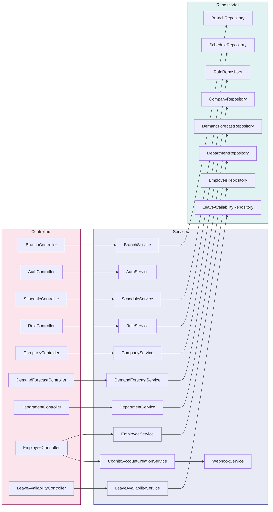

# Backend Specifications

> **Horaion Workforce Management Platform - Backend Specifications**

## Table of Contents

* [Overview](04_BACKEND_SPECIFICATIONS.md#overview)
* [Module Catalog](04_BACKEND_SPECIFICATIONS.md#module-catalog)
* [Module Details](04_BACKEND_SPECIFICATIONS.md#module-details)
* [Inter-Module Communication](04_BACKEND_SPECIFICATIONS.md#inter-module-communication)

***

## Overview

Horaion follows **Vertical Slice Architecture**, where each module is a self-contained feature with its own:

* **Controllers**: REST API endpoints
* **Services**: Business logic
* **Repositories**: Data access
* **Entities**: JPA domain models
* **DTOs**: Request/Response data transfer objects
* **Mappers**: Entity ↔ DTO conversion
* **Exceptions**: Domain-specific errors

### Module Structure

```
modules/{module-name}/
├── {ModuleName}Controller.java      # REST endpoints
├── {ModuleName}Service.java         # Business logic implementation
├── I{ModuleName}Service.java        # Service interface
├── {ModuleName}Repository.java      # Spring Data JPA repository
├── {ModuleName}Mapper.java          # Orika/MapStruct mapper
├── dto/
│   ├── {ModuleName}RequestDTO.java  # Request payload
│   └── {ModuleName}ResponseDTO.java # Response payload
├── entity/
│   └── {ModuleName}.java            # JPA entity
└── exceptions/
    └── {ModuleName}Exception.java   # Custom exceptions
```

***

## Module Catalog

> **For detailed implementation guides, please refer to the specific module documentation.**

### Core Modules
* [Auth Module](02_MODULES/auth/01_OVERVIEW.md) - Authentication & Registration
* [Company Module](02_MODULES/company/01_OVERVIEW.md) - Multi-tenant Root
* [Branch Module](02_MODULES/branch/01_OVERVIEW.md) - Location Management
* [Department Module](02_MODULES/department/01_OVERVIEW.md) - Scheduling Scope

### Employee Domain
* [Employee Module](02_MODULES/employee/01_OVERVIEW.md) - Staff Management
* [Job Title Module](02_MODULES/jobtitle/01_OVERVIEW.md) - Permissions & Levels
* [Leave Availability](02_MODULES/employeeleaveavailability/01_OVERVIEW.md) - Time Off Management

### Scheduling Domain
* [Schedule Module](02_MODULES/schedule/01_OVERVIEW.md) - Roster Generation
* [Shift Module](02_MODULES/shift/01_OVERVIEW.md) - Template Management
* [Demand Forecast](02_MODULES/demandforecast/01_OVERVIEW.md) - AI Prediction Integration
* [Rule Module](02_MODULES/rule/01_OVERVIEW.md) - Business Constraints

---

## Layered Architecture

The following diagram illustrates the verified flow from **Controllers** to **Services** to **Repositories**, including special handling for Authentication and Employee creation.



> **Diagram Explanation**: The verified flow of data through the code.

**Role Breakdown**:
*   **Controller (Pink)**: "The Receptionist". Takes the input, checks validity.
*   **Service (Blue)**: "The Manager". Does the actual thinking and logic.
*   **Repository (Green)**: "The Archivist". Puts files in the cabinet (Database).
*   **Special Cases**: `AuthService` doesn't have a Repository because it talks to AWS, not our DB. `EmployeeService` does both (DB + AWS).

***

## Inter-Module Communication

### Direct Service Calls

Modules can call other module services directly:

```java
@Service
public class ScheduleService {
    private final EmployeeService employeeService;
    private final ShiftService shiftService;
    private final RuleService ruleService;
    
    public void generateSchedule(Long departmentId) {
        // Get employees from Employee module
        List<Employee> employees = employeeService.getActiveEmployeesByDepartment(departmentId);
        
        // Get shifts from Shift module
        List<Shift> shifts = shiftService.getShiftsByDepartment(departmentId);
        
        // Get rules from Rule module
        List<Rule> rules = ruleService.getRulesByDepartment(departmentId);
        
        // Generate schedule...
    }
}
```

### Event-Driven Communication

For decoupled communication, modules can publish events:

```java
// Employee module publishes event
applicationEventPublisher.publishEvent(new EmployeeCreatedEvent(employee));

// Schedule module listens
@EventListener
public void onEmployeeCreated(EmployeeCreatedEvent event) {
    // Update schedule availability
}
```

***

## Best Practices

1. **Keep modules independent**: Avoid tight coupling between modules
2. **Use service interfaces**: Program to interfaces, not implementations
3. **Validate at boundaries**: Validate input at controller and service layers
4. **Use DTOs**: Never expose entities directly in API responses
5. **Handle errors gracefully**: Use domain-specific exceptions
6. **Log comprehensively**: LogAspect handles this automatically
7. **Test in isolation**: Each module should have its own test suite

***

## Next Steps

* [API Design](07_API_DESIGN.md) - Data models and API standards
* [Infrastructure Strategy](08_INFRASTRUCTURE_DEPLOYMENT.md) - Deployment and configuration
* [System Architecture](02_SYSTEM_ARCHITECTURE.md) - System design patterns

## Advanced Module Patterns

### Module Communication Strategies

#### Direct Service Injection

**Pattern**: Modules communicate through direct service dependencies.

```java
@Service
public class ScheduleService {
    
    private final EmployeeService employeeService;
    private final ShiftService shiftService;
    private final RuleService ruleService;
    private final DemandForecastService demandForecastService;
    
    public ScheduleResponseDTO createSchedule(ScheduleRequestDTO request) {
        // Gather data from multiple modules
        List<EmployeeResponseDTO> employees = employeeService.getByDepartment(request.departmentId());
        List<ShiftResponseDTO> shifts = shiftService.getByDepartment(request.departmentId());
        List<RuleResponseDTO> rules = ruleService.getByDepartment(request.departmentId());
        List<DemandForecastResponseDTO> forecasts = demandForecastService.getByDateRange(
            request.departmentId(), request.startDate(), request.endDate()
        );
        
        // Orchestrate schedule generation
        return generateSchedule(employees, shifts, rules, forecasts);
    }
}
```

**Advantages**:

* Simple and straightforward
* Type-safe compilation
* Easy to trace dependencies

**Disadvantages**:

* Creates coupling between modules
* Can lead to circular dependencies
* Harder to test in isolation

***

#### Event-Driven Communication (Future)

**Pattern**: Modules publish events that other modules subscribe to.

```java
// Event definition
public record EmployeeCreatedEvent(
    Long employeeId,
    Long departmentId,
    String emailAddress,
    LocalDateTime timestamp
) {}

// Publisher
@Service
public class EmployeeService {
    
    private final ApplicationEventPublisher eventPublisher;
    
    public EmployeeResponseDTO createEmployee(EmployeeRequestDTO request) {
        Employee employee = // ... create employee
        
        // Publish event
        eventPublisher.publishEvent(new EmployeeCreatedEvent(
            employee.getId(),
            employee.getDepartment().getId(),
            employee.getEmailAddress(),
            LocalDateTime.now()
        ));
        
        return mapper.toResponseDTO(employee);
    }
}

// Subscriber
@Service
public class NotificationService {
    
    @EventListener
    @Async
    public void handleEmployeeCreated(EmployeeCreatedEvent event) {
        // Send welcome email
        emailService.sendWelcomeEmail(event.emailAddress());
        
        // Create notification record
        notificationRepository.save(new Notification(
            event.employeeId(),
            "Welcome to the team!",
            NotificationType.WELCOME
        ));
    }
}
```

***

### Module Extension Points

#### Custom Validators

Each module can define custom validators for business rules:

```java
// Employee module validator
@Component
public class EmployeeValidator {
    
    private final EmployeeRepository employeeRepository;
    
    public void validateForCreation(EmployeeRequestDTO request) {
        // Check email uniqueness
        if (employeeRepository.existsByEmailAddress(request.emailAddress())) {
            throw new ValidationException("Email address already exists");
        }
        
        // Check employee code format
        if (!request.employeeCode().matches("^EMP\\d{4}$")) {
            throw new ValidationException("Employee code must follow format: EMP####");
        }
        
        // Check department capacity
        long currentCount = employeeRepository.countByDepartmentId(request.departmentId());
        Department dept = departmentRepository.findById(request.departmentId()).orElseThrow();
        if (currentCount >= dept.getMaxEmployees()) {
            throw new ValidationException("Department has reached maximum capacity");
        }
    }
}
```

#### Custom Mappers with Business Logic

```java
@Component
public class EmployeeMapper {
    
    private final DepartmentRepository departmentRepository;
    private final EmployeeRoleRepository roleRepository;
    
    public Employee toEntity(EmployeeRequestDTO dto) {
        Employee employee = new Employee();
        employee.setFirstName(dto.firstName());
        employee.setLastName(dto.lastName());
        employee.setEmailAddress(dto.emailAddress());
        employee.setPhoneNumber(dto.phoneNumber());
        employee.setEmployeeCode(dto.employeeCode());
        
        // Fetch and set relationships
        Department dept = departmentRepository.findById(dto.departmentId())
            .orElseThrow(() -> new ResourceNotFoundException("Department not found"));
        employee.setDepartment(dept);
        
        EmployeeRole role = roleRepository.findById(dto.employeeRoleId())
            .orElseThrow(() -> new ResourceNotFoundException("Role not found"));
        employee.setEmployeeRole(role);
        
        // Set defaults
        employee.setIsActive(true);
        employee.setOnPlannedLeave(new ArrayList<>());
        employee.setAdditionalFields(dto.additionalFields() != null ? dto.additionalFields() : new HashMap<>());
        
        return employee;
    }
    
    public EmployeeResponseDTO toResponseDTO(Employee entity) {
        return new EmployeeResponseDTO(
            entity.getId(),
            entity.getFirstName(),
            entity.getLastName(),
            entity.getEmailAddress(),
            entity.getPhoneNumber(),
            entity.getEmployeeCode(),
            entity.getDepartment().getId(),
            entity.getDepartment().getName(),
            entity.getEmployeeRole().getId(),
            entity.getEmployeeRole().getRoleName(),
            entity.getIsActive(),
            entity.getAdditionalFields(),
            entity.getCreatedAt(),
            entity.getUpdatedAt()
        );
    }
}
```

***

## Module-Specific Patterns

### Employee Module: Bulk Operations

**Excel Import Processing**:

```java
@Service
public class EmployeeExcelService {
    
    @Async
    public void processExcelImport(MultipartFile file, String webhookUrl) {
        try {
            List<EmployeeRequestDTO> employees = parseExcelFile(file);
            
            int successCount = 0;
            int failureCount = 0;
            List<ImportResult> results = new ArrayList<>();
            
            for (int i = 0; i < employees.size(); i++) {
                try {
                    EmployeeRequestDTO dto = employees.get(i);
                    EmployeeResponseDTO created = employeeService.createEmployee(dto);
                    
                    results.add(new ImportResult(i, "SUCCESS", created.id(), null));
                    successCount++;
                    
                } catch (Exception e) {
                    results.add(new ImportResult(i, "FAILURE", null, e.getMessage()));
                    failureCount++;
                }
            }
            
            // Send webhook notification
            if (webhookUrl != null) {
                webhookService.sendImportComplete(webhookUrl, new ImportSummary(
                    employees.size(), successCount, failureCount, results
                ));

---


```
