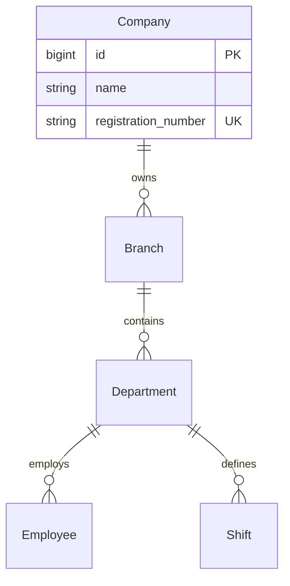

# 06 - Database Specifications

> **Multi-Tenancy Strategy, Data Models, and Standards**

---

## 6.1 Strategy Overview

The Horaion platform is built on **PostgreSQL 15+** and employs a **Shared-Schema Multi-Tenancy** model. This balances cost-efficiency with logical data isolation.

### The Multi-Tenant Hierarchy

All data is strictly scoped to an organization. A user from "Company A" must never see data from "Company B".

*   **Row-Level Isolation**: Almost every table has a `company_id` column.
*   **AOP Enforcement**: A global Hibernate Filter automatically injects `WHERE company_id = ?` into every query based on the logged-in user's JWT context.

---

## 6.2 Key Data Patterns

### Soft Deletion
We rarely physically delete data. Instead, most entities extend `BaseEntity` which provides:
*   `is_active` (boolean): Immediate visibility toggle.
*   `deleted_at` (timestamp): Auditable removal marker.

### Audit Trails
Every modification is tracked:
*   `created_at`, `updated_at`: Timestamps.
*   `created_by`, `updated_by`: User IDs (extracted from Security Context).

### JSONB Extensibility
We leverage PostgreSQL's `JSONB` for flexible schema-less data:
*   `schedules.schedule_data`: Stores the complex output of the Optimization Engine.
*   `employees.additional_fields`: Allows clients to define custom HR attributes.

---

## 6.3 Module Schemas

For detailed column references and entity implementation details, refer to the specific module documentation:

| Domain | Documentation Link |
| :--- | :--- |
| **Employees** | [Employee Domain](../technical_documentation/02_MODULES/employee/03_DOMAIN.md) |
| **Schedules** | [Schedule Domain](../technical_documentation/02_MODULES/schedule/03_DOMAIN.md) |
| **Shifts** | [Shift Domain](../technical_documentation/02_MODULES/shift/03_DOMAIN.md) |
| **Rules** | [Rule Domain](../technical_documentation/02_MODULES/rule/03_DOMAIN.md) |

---

## 6.4 Shared Tables

Some tables belong to the Shared Kernel and are used by all modules:

*   **`cognito_creation_jobs`**: Tracks async user provisioning.
*   **`notification_records`**: Audit log of all sent emails/SMS.

See [Shared Kernel Database](../technical_documentation/16_SHARED_KERNEL/04_DATABASE/01_CONFIGURATIONS.md) for configuration details.
