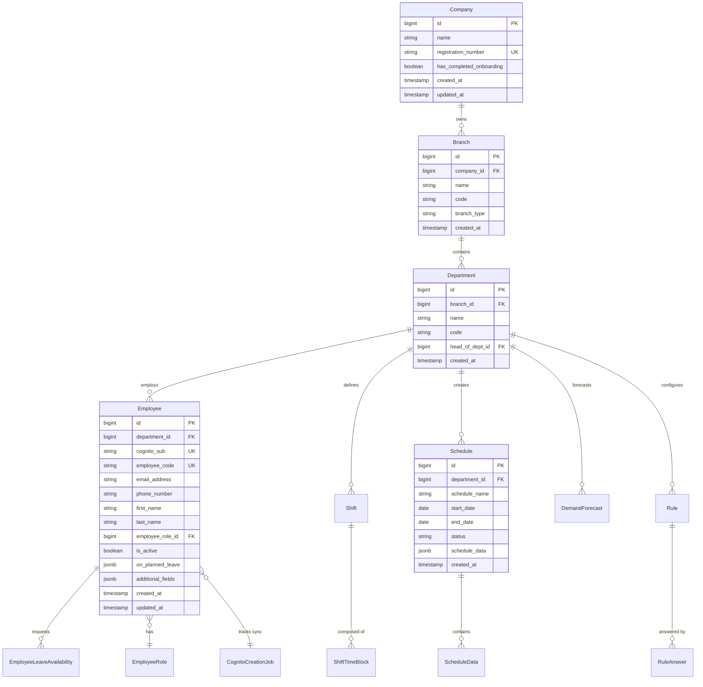
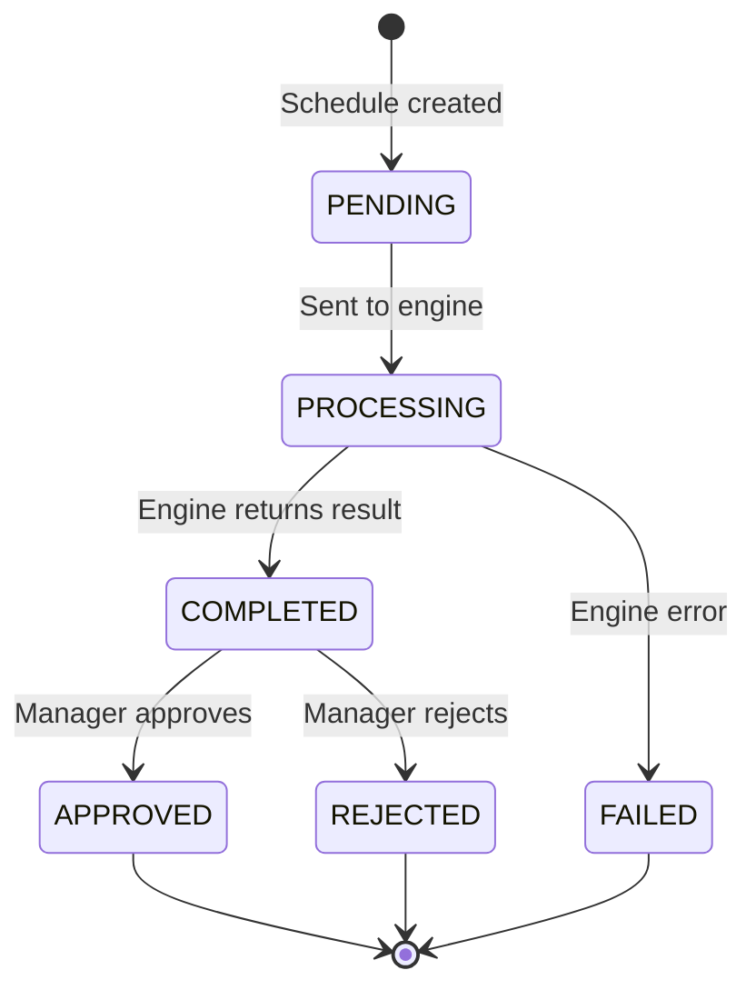
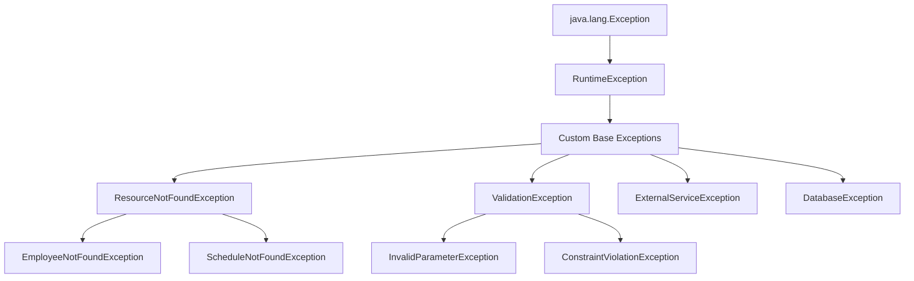

# Database Specifications

> **Genesis Workforce Management Platform - Database Specifications**

## Table of Contents

* [Data Model](06_DATABASE_SPECIFICATIONS.md#data-model)
* [API Standards](06_DATABASE_SPECIFICATIONS.md#api-standards)
* [Error Handling](06_DATABASE_SPECIFICATIONS.md#error-handling)
* [Logging & Observability](06_DATABASE_SPECIFICATIONS.md#logging--observability)
* [Shared Utilities](06_DATABASE_SPECIFICATIONS.md#shared-utilities)

***

## Data Model

### Entity Relationship Diagram

The Genesis data model is organized around a hierarchical multi-tenant structure:



### Core Entities

#### 1. Company

**Purpose**: Root of the multi-tenant hierarchy. Represents an organization using the platform.

**Key Fields**:

* `id` (BIGINT, PK): Auto-incrementing primary key
* `name` (VARCHAR): Company name
* `registration_number` (VARCHAR, UNIQUE): Business registration number
* `has_completed_onboarding` (BOOLEAN): Onboarding status flag

**Relationships**:

* One-to-Many with `Branch`

**Use Cases**:

* Multi-tenant data isolation
* Company-level reporting
* Subscription management

***

#### 2. Branch

**Purpose**: Physical or logical location within a company (e.g., store, office, region).

**Key Fields**:

* `id` (BIGINT, PK)
* `company_id` (BIGINT, FK → Company)
* `name` (VARCHAR): Branch name
* `code` (VARCHAR): Unique branch identifier
* `branch_type` (VARCHAR): Type of branch (e.g., "HEADQUARTERS", "RETAIL")

**Relationships**:

* Many-to-One with `Company`
* One-to-Many with `Department`
* One-to-Many with `Employee`

***

#### 3. Department

**Purpose**: Organizational unit within a branch. The primary scheduling unit.

**Key Fields**:

* `id` (BIGINT, PK)
* `branch_id` (BIGINT, FK → Branch)
* `name` (VARCHAR): Department name (e.g., "Sales", "Operations")
* `code` (VARCHAR): Department code
* `head_of_dept_id` (BIGINT, FK → Employee): Department manager

**Relationships**:

* Many-to-One with `Branch`
* One-to-Many with `Employee`, `Schedule`, `Shift`, `Rule`, `DemandForecast`

**Business Logic**:

* Departments are the scope for schedule generation
* Rules and demand forecasts are department-specific

#### 4. Employee (Detailed Specification)

**Purpose**: Staff member record. Links to AWS Cognito for authentication.

**Key Fields**:

* `id` (BIGINT, PK)
* `department_id` (BIGINT, FK → Department)
* `cognito_sub` (VARCHAR(255), UNIQUE): AWS Cognito user ID
* `employee_code` (VARCHAR(50), UNIQUE): Internal employee identifier
* `email_address` (VARCHAR(255)): Email for login
* `phone_number` (VARCHAR(20)): Contact number
* `first_name`, `last_name` (VARCHAR(255)): Name fields
* `employee_role_id` (BIGINT, FK → EmployeeRole): Job role
* `role_proficiency` (BOOLEAN, Default: false): Proficiency indicator
* `is_part_time` (BOOLEAN, Default: false): Employment status
* `end_of_probation` (BOOLEAN, Default: false): Probation flag
* `availability` (VARCHAR(255)): Availability description
* `is_active` (BOOLEAN, Default: true): Active status
* `on_planned_leave` (JSONB): Leave dates in JSON format
* `additional_fields` (JSONB): Extensible custom fields

**Data Import Specification (Excel Mapping)**:

> **Note**: Column headers are case-insensitive and ignore spaces/underscores (e.g., "First Name", "firstname", "First\_Name" are treated as identical).

| Excel Header       | Mapped Entity Field | Required | Data Type/Validation                |
| ------------------ | ------------------- | -------- | ----------------------------------- |
| `First Name`       | `firstName`         | **Yes**  | Text (`min: 2`, `max: 100`)         |
| `Last Name`        | `lastName`          | **Yes**  | Text (`min: 2`, `max: 100`)         |
| `Phone Number`     | `phoneNumber`       | **Yes**  | Text (E.164 preferred)              |
| `Email Address`    | `emailAddress`      | **Yes**  | Valid Email                         |
| `Branch`           | _(Resolved to ID)_  | **Yes**  | Name of existing Branch             |
| `Department`       | _(Resolved to ID)_  | **Yes**  | Name of existing Department         |
| `Role`             | _(Resolved to ID)_  | **Yes**  | Name of existing Role               |
| `Role Proficiency` | `roleProficiency`   | **Yes**  | `['Yes', 'No']` (Mapped to Boolean) |
| `Is Part Time`     | `isPartTime`        | **Yes**  | `['Yes', 'No']` (Mapped to Boolean) |
| `End of Probation` | `endOfProbation`    | No       | `['Yes', 'No']` (Default: 'No')     |

**Processing Logic**:

1. **Normalization**: Headers are normalized (lowercase, no spaces).
2. **Validation**: Missing required columns throws `ExcelParseException`.
3. **Resolution**: `Branch`, `Department`, and `Role` names are stored temporarily (`_branchName`, etc.) and resolved to database IDs during strict processing; invalid names will cause row failure.

**Relationships**:

* Many-to-One with `Department`, `EmployeeRole`
* One-to-Many with `EmployeeLeaveAvailability`

**Special Features**:

* **Cognito Integration**: `cognito_sub` links to AWS Cognito user pool
* **JSONB Fields**: Flexible schema for custom attributes
* **Audit Trail**: `created_at`, `updated_at` timestamps

***

#### 5. Schedule

**Purpose**: Generated work schedule for a department over a date range.

**Key Fields**:

* `id` (BIGINT, PK)
* `department_id` (BIGINT, FK → Department)
* `schedule_name` (VARCHAR): Descriptive name
* `start_date`, `end_date` (DATE): Schedule period
* `status` (VARCHAR): Lifecycle status (PENDING, PROCESSING, COMPLETED, FAILED, APPROVED)
* `schedule_data` (JSONB): Full schedule result from optimization engine

**Lifecycle States**:



***

#### 6. Shift

**Purpose**: Template for work shifts (e.g., "Morning Shift", "Night Shift").

**Key Fields**:

* `id` (BIGINT, PK)
* `department_id` (BIGINT, FK → Department)
* `shift_name` (VARCHAR): Shift name
* `shift_type` (VARCHAR): Type (FULL\_TIME, PART\_TIME, etc.)
* `time_blocks` (JSONB): Array of time blocks (start/end times)

**Example Time Blocks**:

```json
[
  {"start": "09:00", "end": "13:00"},
  {"start": "14:00", "end": "18:00"}
]
```

***

### Data Patterns

#### Audit Fields

All entities include standard audit columns:

```sql
created_at TIMESTAMP DEFAULT CURRENT_TIMESTAMP
updated_at TIMESTAMP DEFAULT CURRENT_TIMESTAMP ON UPDATE CURRENT_TIMESTAMP
```

#### Soft Delete

Most entities support soft deletion:

```sql
is_active BOOLEAN DEFAULT TRUE
deleted_at TIMESTAMP NULL
```

#### JSONB Usage

JSONB columns provide schema flexibility:

* `Employee.on_planned_leave`: Leave dates
* `Employee.additional_fields`: Custom attributes
* `Schedule.schedule_data`: Full optimization result
* `Shift.time_blocks`: Shift time ranges

***

## API Standards

### Request/Response Envelope

All API responses use a consistent wrapper: `ApiResponseDTO<T>`

```java
public record ApiResponseDTO<T>(
    Boolean success,
    T data,
    String message,
    LocalDateTime timestamp
) {}
```

#### Success Response Example

```json
{
  "success": true,
  "data": {
    "id": 42,
    "firstName": "John",
    "lastName": "Doe",
    "emailAddress": "john.doe@example.com",
    "departmentName": "Sales",
    "branchName": "New York",
    "companyName": "Acme Corp",
    "isActive": true
  },
  "message": "Employee retrieved successfully",
  "timestamp": "2026-01-30T16:00:00"
}
```

#### Error Response Example

Uses RFC 7807 Problem Details:

```json
{
  "type": "about:blank",
  "title": "Not Found",
  "status": 404,
  "detail": "Employee with ID 999 not found",
  "instance": "/api/v1/employees/999"
}
```

### RESTful Conventions

| HTTP Method | URL Pattern               | Purpose              | Success Status |
| ----------- | ------------------------- | -------------------- | -------------- |
| `GET`       | `/api/v1/{resource}`      | List all (paginated) | 200 OK         |
| `GET`       | `/api/v1/{resource}/{id}` | Get by ID            | 200 OK         |
| `POST`      | `/api/v1/{resource}`      | Create new           | 201 Created    |
| `PUT`       | `/api/v1/{resource}/{id}` | Update existing      | 200 OK         |
| `DELETE`    | `/api/v1/{resource}/{id}` | Delete (soft delete) | 204 No Content |

### Pagination

Standard pagination parameters:

* `page` (int, default: 0): Zero-indexed page number
* `size` (int, default: 10): Items per page
* `sortBy` (string, default: varies): Field to sort by
* `sortDirection` (string, default: "ASC"): "ASC" or "DESC"

**Example Request**:

```
GET /api/v1/employees?page=0&size=20&sortBy=lastName&sortDirection=ASC
```

**Paginated Response**:

```json
{
  "success": true,
  "data": {
    "content": [ /* array of items */ ],
    "page": 0,
    "size": 20,
    "totalElements": 145,
    "totalPages": 8,
    "last": false
  },
  "message": "Employees retrieved successfully",
  "timestamp": "2026-01-30T16:00:00"
}
```

***

## Error Handling

### Exception Hierarchy



### Global Exception Handler

The `GlobalExceptionHandler` catches all exceptions and converts them to RFC 7807 Problem Details.

**Key Handlers**:

1. `@ExceptionHandler(ResourceNotFoundException.class)` → 404 Not Found
2. `@ExceptionHandler(MethodArgumentNotValidException.class)` → 400 Bad Request (validation)
3. `@ExceptionHandler(RuntimeException.class)` → 500 Internal Server Error
4. `@ExceptionHandler(AsyncRequestTimeoutException.class)` → 504 Gateway Timeout

**Example Handler**:

```java
@ExceptionHandler(ResourceNotFoundException.class)
public ResponseEntity<ProblemDetailsDTO> handleResourceNotFound(
    ResourceNotFoundException ex,
    HttpServletRequest request
) {
    ProblemDetailsDTO problem = new ProblemDetailsDTO(
        "about:blank",
        "Not Found",
        404,
        ex.getMessage(),
        request.getRequestURI()
    );
    return ResponseEntity.status(404).body(problem);
}
```

***

## Logging & Observability

### LogAspect (AOP Logging)

The `LogAspect` automatically logs all service and controller method executions.

**Features**:

* **Request ID Generation**: Unique 8-character ID for each request
* **MDC Context**: Populates Mapped Diagnostic Context with `requestId`, `userId`, `httpMethod`, `endpoint`
* **Execution Timing**: Logs method duration
* **User Context**: Extracts user ID from JWT token
* **HTTP Context**: Captures HTTP method and endpoint for web requests

**Pointcuts**:

```java
@Pointcut("execution(public * com.resetrix.genesis..services..*(..))")
public void serviceMethods() {}

@Pointcut("within(@org.springframework.web.bind.annotation.RestController *)")
public void controllerMethods() {}
```

**Log Output Example**:

```
2026-01-30 16:00:00 [A1B2C3D4] [user-123] - Entering EmployeeService.createEmployee()
2026-01-30 16:00:01 [A1B2C3D4] [user-123] - Exiting EmployeeService.createEmployee() - Duration: 1234ms
```

### MDC Fields

| Field        | Description                 | Example             |
| ------------ | --------------------------- | ------------------- |
| `requestId`  | Unique request identifier   | `A1B2C3D4`          |
| `userId`     | Cognito user ID (sub claim) | `user-123`          |
| `httpMethod` | HTTP method                 | `POST`              |
| `endpoint`   | Request path                | `/api/v1/employees` |

***

## Shared Utilities

### ValidationHelper

Centralized validation for common parameters:

```java
// Validate pagination
ValidationHelper.validatePaginationParameters(page, size);

// Validate sort direction
Sort.Direction direction = ValidationHelper.parseSortDirection("ASC");

// Validate ID
ValidationHelper.validateId(employeeId, "Employee");

// Validate sort field
ValidationHelper.validateSortBy(sortBy, "firstName", "lastName", "emailAddress");
```

### RepositoryHelper

Standardized entity retrieval with error handling:

```java
// Find by ID or throw ResourceNotFoundException
Employee employee = RepositoryHelper.findByIdOrThrow(
    employeeRepository, 
    id, 
    Employee.class
);

// Find by UUID or throw
Employee employee = RepositoryHelper.findByUuidOrThrow(
    employeeRepository, 
    uuid, 
    Employee.class
);
```

***

## Next Steps

* [MODULES.md](../compiled/technical_documentation/MODULES.md) - Detailed module documentation
* [OPERATIONS.md](../compiled/technical_documentation/OPERATIONS.md) - Deployment and configuration
* [ARCHITECTURE.md](../compiled/technical_documentation/ARCHITECTURE.md) - System design and patterns

***
