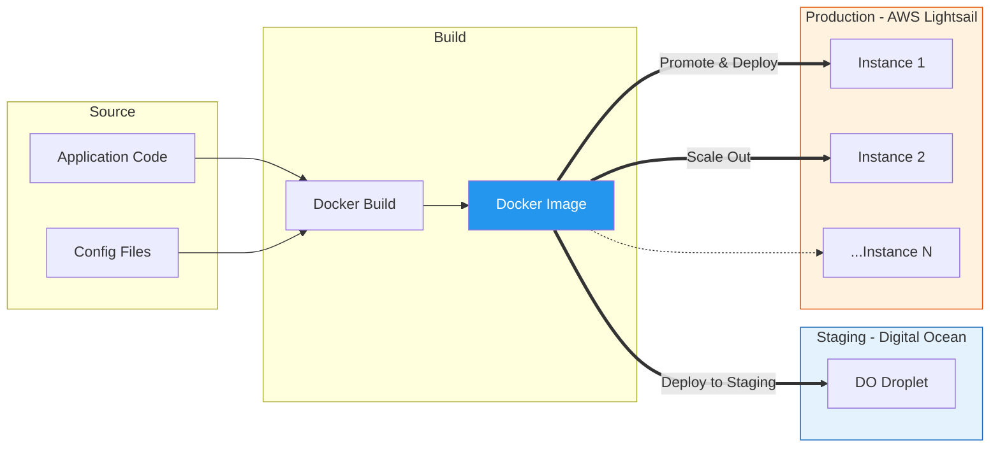

# Infrastructure & Deployment

> **Horaion Workforce Management Platform - Infrastructure & Deployment**

## Table of Contents

* [Deployment](08_INFRASTRUCTURE_DEPLOYMENT.md#deployment)
* [Configuration](08_INFRASTRUCTURE_DEPLOYMENT.md#configuration)
* [Database Management](08_INFRASTRUCTURE_DEPLOYMENT.md#database-management)
* [Monitoring & Health Checks](08_INFRASTRUCTURE_DEPLOYMENT.md#monitoring--health-checks)
* [Troubleshooting](08_INFRASTRUCTURE_DEPLOYMENT.md#troubleshooting)

***

## Deployment Strategy

### Environment Overview

Horaion employs a dual-cloud strategy to separate testing/staging from production workloads:

| Environment    | Platform          | Purpose              | Access            |
| -------------- | ----------------- | -------------------- | ----------------- |
| **Staging**    | **Digital Ocean** | Testing, QA, Staging | Internal Dev Team |
| **Production** | **AWS Lightsail** | Live User Traffic    | End Users, Admins |

> **Note**: Current Setup uses manual Docker deployment as per the Bespoke Phase strategy.

### Deployment Pipeline

The deployment flow leverages **Docker** containers to ensure consistency across environments.



> **Diagram Explanation**:
>
> 1. **Build**: The application and configuration are built into a standard **Docker Image**.
> 2. **Staging (Digital Ocean)**: The image is first deployed to a Digital Ocean Droplet. This environment mirrors production settings and is used for final verification (QA/UAT).
> 3. **Production (AWS Lightsail)**: Once verified, the _same_ Docker image is promoted to AWS Lightsail. The production environment can scale horizontally across multiple Lightsail instances to handle user load.

### Artifact Promotion Strategy
The deployment pipeline enforces environment consistency via immutable artifacts.

1.  **Development & Build**: Code is developed and tested locally. Upon commit, the CI pipeline builds a standard **Docker Image**, encapsulating the application code, runtime dependencies (Java), and OS configuration.
2.  **Staging Environment**: This immutable image is deployed to the Staging environment (Digital Ocean) for Quality Assurance (QA) and User Acceptance Testing (UAT).
3.  **Production Promotion**: Once validated, the **exact same image hash** is promoted to the Production environment (AWS Lightsail). This eliminates "it works on my machine" discrepancies by ensuring the production runtime is bit-for-bit identical to the tested artifact.

***

## Deployment

### Prerequisites

* **Java 21** (Eclipse Temurin or OpenJDK)
* **PostgreSQL 15+**
* **Maven 3.8+**
* **Docker** (optional, for containerized deployment)
* **AWS Account** (for Cognito, SES, SNS/SQS)

### Local Development

#### Clone Repository

```bash
git clone <repository-url>
cd horaion/api_app/horaion-api
```

#### Configure Environment Variables

Create a `.env` file or set environment variables:

```bash
# Application
APPLICATION_PORT=8080

# Database
POSTGRES_DB_HOST=localhost
POSTGRES_DB_PORT=5432
POSTGRES_DB_NAME=horaion
POSTGRES_DB_USER=horaion_user
POSTGRES_DB_PASS=your_password

# Database Connection Pool
DB_POOL_SIZE=20
DB_POOL_MIN_IDLE=5
DB_IDLE_TIMEOUT=600000
DB_MAX_LIFETIME=3600000
DB_CONNECTION_TIMEOUT=60000
DB_LEAK_DETECTION=0

# AWS Cognito
AWS_REGION=ap-southeast-1
AWS_COGNITO_USER_POOL_ID=ap-southeast-1_XXXXXXXXX
AWS_COGNITO_CLIENT_ID=your_client_id
AWS_COGNITO_CLIENT_SECRET=your_client_secret

# AWS Credentials (optional, use IAM roles in production)
AWS_ACCESS_KEY_ID=your_access_key
AWS_SECRET_ACCESS_KEY=your_secret_key

# External Services
SCHEDULE_ENGINE_HOST=https://engine.example.com
ENGINE_ALLOWED_IPS=10.0.0.0/8,192.168.0.0/16

# Webhook Configuration
COGNITO_WEBHOOK_URL=https://your-app.com/webhook
WEBHOOK_RETRY_ATTEMPTS=3
WEBHOOK_RETRY_DELAY_MS=1000
```

#### Run Database Migrations

```bash
./mvnw flyway:migrate
```

#### Build and Run

```bash
# Build
./mvnw clean package

# Run
./mvnw spring-boot:run
```

#### Verify Deployment

```bash
# Health check
curl http://localhost:8080/actuator/health

# Expected response:
# {"status":"UP"}
```

***

### Docker Deployment

#### Build Docker Image

```bash
# Multi-stage build
docker build -t horaion-api:latest .
```

#### Run with Docker Compose

Create `docker-compose.yml`:

```yaml
version: '3.8'

services:
  postgres:
    image: postgres:15-alpine
    environment:
      POSTGRES_DB: horaion
      POSTGRES_USER: horaion_user
      POSTGRES_PASSWORD: your_password
    ports:
      - "5432:5432"
    volumes:
      - postgres_data:/var/lib/postgresql/data
    healthcheck:
      test: ["CMD-SHELL", "pg_isready -U horaion_user -d horaion"]
      interval: 10s
      timeout: 5s
      retries: 5

  horaion-api:
    image: horaion-api:latest
    ports:
      - "8080:8080"
    environment:
      POSTGRES_DB_HOST: postgres
      POSTGRES_DB_PORT: 5432
      POSTGRES_DB_NAME: horaion
      POSTGRES_DB_USER: horaion_user
      POSTGRES_DB_PASS: your_password
      AWS_REGION: ap-southeast-1
      AWS_COGNITO_USER_POOL_ID: ${AWS_COGNITO_USER_POOL_ID}
      AWS_COGNITO_CLIENT_ID: ${AWS_COGNITO_CLIENT_ID}
      AWS_COGNITO_CLIENT_SECRET: ${AWS_COGNITO_CLIENT_SECRET}
      SCHEDULE_ENGINE_HOST: ${SCHEDULE_ENGINE_HOST}
    depends_on:
      postgres:
        condition: service_healthy
    healthcheck:
      test: ["CMD", "wget", "--quiet", "--tries=1", "--spider", "http://localhost:8080/actuator/health"]
      interval: 30s
      timeout: 10s
      retries: 3
      start_period: 60s

volumes:
  postgres_data:
```

Run:

```bash
docker-compose up -d
```

***

## Configuration Strategy

We follow the **12-Factor App** methodology. Configurations are stored in environment variables, not code.

For a detailed reference of all configuration properties (YAML) and their Java mappings, see:

*   **Global Properties**: [Shared Resouces - Properties](../technical_documentation/16_SHARED_KERNEL/09_GLOBAL_RESOURCES/02_PROPERTIES.md)
*   **Java Beans**: [Shared Kernel - Configurations](../technical_documentation/16_SHARED_KERNEL/02_CORE/01_CONFIGURATIONS.md)

### Environment Variables

| Variable | Required | Description |
|---|---|---|
| `POSTGRES_DB_HOST` | Yes | Database Hostname |
| `AWS_COGNITO_USER_POOL_ID` | Yes | Auth Provider ID |
| `SCHEDULE_ENGINE_HOST` | Yes | Optimization Service URL |
| `SPRING_PROFILES_ACTIVE` | No | `dev`, `prod`, or `local` |

---

## Database Management

We use **Flyway** for schema migrations. This ensures that the database schema is versioned along with the code.

*   To see the full history of migrations, refer to: [Global Resources - Migrations](../technical_documentation/16_SHARED_KERNEL/09_GLOBAL_RESOURCES/03_MIGRATIONS.md).

---

## Monitoring & Health Checks

### Spring Boot Actuator

The application exposes standard health endpoints for the load balancer:

*   `GET /actuator/health`: Returns 200 OK if DB and Disk are healthy.
*   `GET /actuator/info`: Git build information.

### Logging

Logs are piped to `stdout` (for Docker capture) and written to rolling files in `/var/log`. We use **MDC (Mapped Diagnostic Context)** to tag every log line with:
*   `requestId`
*   `userId`
*   `tenantId`

For Logback configuration details, see [Shared Kernel - Logging](../technical_documentation/16_SHARED_KERNEL/05_LOGGING/04_PROPERTIES.md).

### Environment Variables Reference

| Variable | Required | Default | Description | Impact of Misconfiguration |
|---|---|---|---|---|
| `APPLICATION_PORT` | No | `8080` | HTTP server port | Port conflicts if set to an occupied port. |
| `POSTGRES_DB_HOST` | Yes | - | PostgreSQL hostname | App crashes immediately on startup (Connection Refused). |
| `POSTGRES_DB_PORT` | No | `5432` | PostgreSQL port | Connection failure if DB is non-standard. |
| `POSTGRES_DB_NAME` | Yes | - | Database name | App cannot find tables ("relation does not exist"). |
| `POSTGRES_DB_USER` | Yes | - | Database username | Auth failure (password authentication failed). |
| `POSTGRES_DB_PASS` | Yes | - | Database password | Auth failure. |
| `DB_POOL_SIZE` | No | `20` | Max active DB connections | **Too Low**: High latency under load (requests wait for connection).<br/>**Too High**: DB CPU spikes, diminishing returns. |
| `DB_POOL_MIN_IDLE` | No | `5` | Min idle connections | **Too Low**: Latency spike on sudden traffic bursts (waiting for new connection creation). |
| `AWS_REGION` | Yes | - | AWS region (e.g. `us-east-1`) | Cognito calls fail with 400 Bad Request if mismatches User Pool. |
| `AWS_COGNITO_USER_POOL_ID` | Yes | - | User Pool ID | All logins fail. |
| `AWS_COGNITO_CLIENT_ID` | Yes | - | App Client ID | Client cannot initiate auth flow. |
| `AWS_COGNITO_CLIENT_SECRET` | Yes | - | App Client Secret | Token exchange fails (Unauthorized key). |
| `SCHEDULE_ENGINE_HOST` | Yes | - | Optimization Engine URL | Schedule generation fails immediately. |
| `ENGINE_ALLOWED_IPS` | Yes | - | Whitelisted IP ranges | **Security Risk**: If empty or `0.0.0.0/0`, anyone can fake an engine callback and inject corrupt schedules. |

### Application Profiles

Horaion supports multiple Spring profiles:

* **local**: Local development (verbose logging, SQL logging enabled)
* **dev**: Development environment
* **sit**: System Integration Testing
* **prod**: Production (minimal logging, optimized performance)

Activate a profile:

```bash
export SPRING_PROFILES_ACTIVE=prod
./mvnw spring-boot:run
```

Or in `application.yaml`:

```yaml
spring:
  profiles:
    active: ${SPRING_PROFILES_ACTIVE:local}
```

***

## Database Management

### Flyway Migrations

Horaion uses Flyway for database schema versioning.

**Migration Files**: `src/main/resources/db/migrations/`

| File                                   | Description                        |
| -------------------------------------- | ---------------------------------- |
| `V1__organizational_structure.sql`     | Company, Branch, Department tables |
| `V2__employee_management.sql`          | Employee, EmployeeRole tables      |
| `V3__shift_management.sql`             | Shift, ShiftTimeBlock tables       |
| `V4__schedule_management.sql`          | Schedule, ScheduleData tables      |
| `V5__business_rules.sql`               | Rule, RuleAnswer tables            |
| `V6__demand_forecasting.sql`           | DemandForecast table               |
| `V7__indexes.sql`                      | Performance indexes                |
| `V8__triggers_functions.sql`           | Database triggers and functions    |
| `V9__sample_data.sql`                  | Sample data for testing            |
| `V10__employee_request_management.sql` | Leave request tables               |
| `V11__cognito_creation_jobs.sql`       | Cognito sync tracking              |

### Running Migrations

```bash
# Run all pending migrations
./mvnw flyway:migrate

# Validate migrations
./mvnw flyway:validate

# Show migration info
./mvnw flyway:info

# Repair migration history (use with caution)
./mvnw flyway:repair
```

### Connection Pool Configuration

HikariCP settings in `application.yaml`:

```yaml
spring:
  datasource:
    hikari:
      maximum-pool-size: ${DB_POOL_SIZE:20}
      minimum-idle: ${DB_POOL_MIN_IDLE:5}
      idle-timeout: ${DB_IDLE_TIMEOUT:600000}      # 10 minutes
      max-lifetime: ${DB_MAX_LIFETIME:3600000}     # 60 minutes
      connection-timeout: ${DB_CONNECTION_TIMEOUT:60000}  # 60 seconds
      leak-detection-threshold: ${DB_LEAK_DETECTION:0}  # 0 = disabled
```

**Recommendations**:

* **Development**: `maximum-pool-size: 10`
* **Production**: `maximum-pool-size: 20-50` (based on load)
* **Long-running operations**: Disable leak detection (`0`) to avoid false positives

***

## Monitoring & Health Checks

### Spring Boot Actuator

Horaion exposes several actuator endpoints:

| Endpoint               | Purpose            | Authentication |
| ---------------------- | ------------------ | -------------- |
| `/actuator/health`     | Health status      | Public         |
| `/actuator/info`       | Build information  | Public         |
| `/actuator/prometheus` | Prometheus metrics | Protected      |

#### Health Check

```bash
curl http://localhost:8080/actuator/health
```

Response:

```json
{
  "status": "UP",
  "components": {
    "db": {
      "status": "UP",
      "details": {
        "database": "PostgreSQL",
        "validationQuery": "isValid()"
      }
    },
    "diskSpace": {
      "status": "UP",
      "details": {
        "total": 500000000000,
        "free": 250000000000,
        "threshold": 10485760
      }
    }
  }
}
```

### Logging

#### Log Levels

Configured in `application.yaml`:

```yaml
logging:
  level:
    root: INFO
    com.horaion.app: INFO  # Application logs
    org.springframework.web: WARN
    org.hibernate.SQL: DEBUG  # SQL queries (dev only)
```

#### Log Format

**Console** (development):

```
%d{yyyy-MM-dd HH:mm:ss} [%X{requestId}] [%X{userId}] - %msg%n
```

**File** (production):

```
%d{yyyy-MM-dd HH:mm:ss} [%thread] %-5level %logger{36} [%X{requestId}] [%X{userId}] - %msg%n
```

#### MDC Fields

All logs include:

* `requestId`: Unique request identifier
* `userId`: Cognito user ID (if authenticated)

#### Viewing Logs

```bash
# Docker logs
docker logs horaion-api -f

# Tail application logs
tail -f logs/application.log

# Search for specific request
grep "A1B2C3D4" logs/application.log
```

### Metrics

Horaion integrates with Micrometer for metrics collection.

**Key Metrics**:

* `http.server.requests`: HTTP request metrics (count, duration, percentiles)
* `jvm.memory.used`: JVM memory usage
* `hikaricp.connections.active`: Active database connections
* `hikaricp.connections.idle`: Idle database connections

**Prometheus Scrape Config**:

```yaml
scrape_configs:
  - job_name: 'horaion-api'
    metrics_path: '/actuator/prometheus'
    static_configs:
      - targets: ['localhost:8080']
```

***

## Troubleshooting

### Common Issues

#### Database Connection Failures

**Symptom**: Application fails to start with `Connection refused` or `Unknown database`

**Solutions**:

```bash
# Check PostgreSQL is running
pg_isready -h localhost -p 5432

# Verify credentials
psql -h localhost -U horaion_user -d horaion

# Check environment variables
echo $POSTGRES_DB_HOST
echo $POSTGRES_DB_NAME
```

#### Flyway Migration Failures

**Symptom**: `FlywayException: Validate failed: Migration checksum mismatch`

**Solutions**:

```bash
# Repair migration history
./mvnw flyway:repair

# If necessary, clean and re-migrate (CAUTION: deletes all data)
./mvnw flyway:clean
./mvnw flyway:migrate
```

#### Cognito Authentication Errors

**Symptom**: `401 Unauthorized` or `Invalid JWT token`

**Solutions**:

```bash
# Verify Cognito configuration
echo $AWS_COGNITO_USER_POOL_ID
echo $AWS_COGNITO_CLIENT_ID

# Check JWT token expiration
# Decode token at https://jwt.io

# Verify Cognito user pool region matches AWS_REGION
```

#### Schedule Generation Timeout

**Symptom**: `AsyncRequestTimeoutException` or `504 Gateway Timeout`

**Solutions**:

```yaml
# Increase timeouts in application.yaml
server:
  async:
    request-timeout: -1  # Infinite
  tomcat:
    connection-timeout: 2700000  # 45 minutes

feign:
  client:
    config:
      engine:
        connectTimeout: 0
        readTimeout: 0
```

#### High Memory Usage

**Symptom**: `OutOfMemoryError` or slow performance

**Solutions**:

```bash
# Increase JVM heap size
export JAVA_OPTS="-Xms512m -Xmx2048m"
./mvnw spring-boot:run

# Monitor memory usage
curl http://localhost:8080/actuator/metrics/jvm.memory.used

# Analyze heap dump
jmap -dump:live,format=b,file=heap.bin <PID>
```

### Diagnostic Tools

#### Engine Connectivity Test

Horaion includes a diagnostic tool to test engine connectivity:

```java
// Located at: com.horaion.app.shared.diagnostics.EngineConnectivityTest
```

Run manually or via endpoint (if exposed).

#### Database Query Performance

```sql
-- Check slow queries
SELECT query, calls, total_time, mean_time
FROM pg_stat_statements
ORDER BY mean_time DESC
LIMIT 10;

-- Check active connections
SELECT count(*) FROM pg_stat_activity;

-- Check table sizes
SELECT schemaname, tablename, pg_size_pretty(pg_total_relation_size(schemaname||'.'||tablename))
FROM pg_tables
WHERE schemaname = 'public'
ORDER BY pg_total_relation_size(schemaname||'.'||tablename) DESC;
```

***

## Performance Tuning

### JVM Options

```bash
# Production JVM settings
JAVA_OPTS="
  -Xms1g
  -Xmx2g
  -XX:+UseG1GC
  -XX:MaxGCPauseMillis=200
  -XX:+HeapDumpOnOutOfMemoryError
  -XX:HeapDumpPath=/var/log/horaion/heap_dump.hprof
"
```

### Database Optimization

```sql
-- Add indexes for frequently queried columns
CREATE INDEX idx_employee_cognito_sub ON employees(cognito_sub);
CREATE INDEX idx_employee_email ON employees(email_address);
CREATE INDEX idx_schedule_department_id ON schedules(department_id);
CREATE INDEX idx_schedule_status ON schedules(status);

-- Analyze tables for query planner
ANALYZE employees;
ANALYZE schedules;
```

### Connection Pool Sizing

**Formula**: `connections = ((core_count * 2) + effective_spindle_count)`

For a 4-core server with SSD:

```yaml
spring:
  datasource:
    hikari:
      maximum-pool-size: 10  # (4 * 2) + 1 (SSD)
```

***

## Security Best Practices

1. **Never commit secrets**: Use environment variables or secret managers
2. **Rotate credentials**: Regularly rotate database and AWS credentials
3. **Use IAM roles**: In AWS environments, use IAM roles instead of access keys
4. **Enable HTTPS**: Use TLS/SSL for all external communication
5. **IP whitelisting**: Restrict engine callback endpoints to known IPs
6. **Audit logging**: Monitor access logs for suspicious activity

***

## Next Steps

* [System Architecture](02_SYSTEM_ARCHITECTURE.md) - System design and patterns
* [API Design](07_API_DESIGN.md) - Data models and API standards
* [Backend Strategy](04_BACKEND_SPECIFICATIONS.md) - Module-specific documentation
