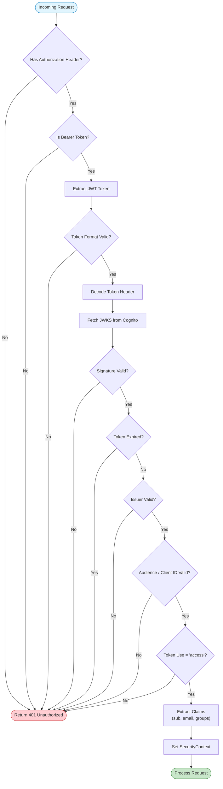

# 09 - Security Requirements


> **Genesis Workforce Management Platform - Security Requirements**

---

## 12.1 Authentication & Authorization


### JWT Validation Logic

The following flowchart details the exact validation steps performed for every incoming request:



### Current Implementation

#### Authentication (✅ Implemented)
- **Provider**: AWS Cognito
- **Method**: JWT tokens
- **Validation Steps**:
  1. **Issuer**: Changes against Cognito User Pool Issuer URI.
  2. **Audience**: Validates `aud` claim matches Client ID.
  3. **Signature**: RS256 verification against JWKS (cached).
  4. **Expiration**: Rejects expired `exp` timestamps.
  5. **Token Use**: Ensures `token_use` claim is `id` or `access`.

#### JWT Token Structure
```json
{
  "sub": "a1b2c3d4-e5f6-7890-abcd-ef1234567890",
  "email": "user@example.com",
  "custom:companyId": "123",
  "cognito:groups": ["Managers"],
  "exp": 1706889600
}
```

### Authorization
- **Access Control**: Valid JWT required for all protected endpoints.
- **Scope Enforcement**: User actions are strictly scoped to their authenticated `companyId` (extracted from JWT `custom:companyId`).
- **Role Validation**: Basic role checks (e.g., `Manager`, `Employee`) enforce access to administrative endpoints.

---

## 12.2 Data Security

### Encryption

#### At Rest
- **Database**: PostgreSQL on AWS Lightsail/DO (Encrypted Volume).
- **Database**: PostgreSQL on AWS Lightsail/DO (Encrypted Volume).
- **Sensitive Fields**: Standard PII (Name, Email, Phone) stored with standard access controls.

#### In Transit
- **HTTPS**: All API communication over TLS 1.2+
- **Certificate**: Let's Encrypt (Staging/Prod) or AWS ACM.

### Data Isolation

#### Multi-Tenancy
- **Method**: Row-level security by `company_id`
- **Enforcement**: All queries filtered by company context
- **Validation**: JWT token contains `custom:companyId`

**Implementation**:
```java
// All queries automatically filtered
SELECT * FROM employees 
WHERE company_id = :currentCompanyId 
AND department_id = :deptId;
```

### Sensitive Data Handling

#### PII Protection
### Sensitive Data Handling

#### PII Protection
- **Fields**: Name, Phone Number, Email.
- **Protection**:
  - **Storage**: Standard DB Access Controls (Role-based).
  - **Access**: Restricted to Company Admins/Managers.
  - **Retention**: Data retained until Employee deletion (Right to Erasure supported via Delete API).

### Audit Logging

#### Current Implementation
- **LogAspect**: Logs all controller method calls
- **MDC Fields**: `requestId`, `userId`
- **Log Level**: INFO for requests, WARN for errors

#### Audit Trail Requirements
- **Action Logging**: All `POST/PUT/DELETE` requests are logged.
- **Storage**: Application Logs (CloudWatch / Digital Ocean Logs).
- **Retention**: 30 days (Rolling window).

---

## 12.3 Network Security

### API Security

#### CORS Configuration
- **Allowed Origins**: 
    - **Development**: `http://localhost:3000`
    - **Staging/Prod**: Restricted to hosted frontend domain.
- **Allowed Methods**: GET, POST, PUT, DELETE
- **Allowed Headers**: Authorization, Content-Type
- **Credentials**: Allowed


### IP Whitelisting

#### Engine Callback Endpoints
- **Configuration**: `ENGINE_ALLOWED_IPS` (Env Var).
- **Format**: Comma-separated CIDR blocks or IPs.
- **Header Parsing**: Trust hierarchy: `X-Forwarded-For` > `X-Real-IP` > `Proxy-Client-IP`.

**Current Protection**:
```java
// Engine callback endpoints restricted by IP
if (!allowedIPs.contains(requestIP)) {
    return 403 Forbidden;
}
```

### Firewall Rules
- **Inbound Ports**: 
  - `80/443`: Public Web Traffic (Allowed)
  - `5432`: Database (Private VPC only)
  - `22`: SSH (Restricted to Jump Host/VPN)
- **Protection**: AWS Security Groups / Digital Ocean Cloud Firewall.

---

## Security Best Practices

### Implemented ✅

1. **JWT Validation**: All requests validated
2. **Password Security**: Managed by AWS Cognito
3. **SQL Injection Prevention**: JPA/Hibernate parameterized queries
4. **XSS Prevention**: JSON responses, no HTML rendering
5. **CSRF Protection**: Stateless API (no cookies)

---

## Next Steps

1. **Define user roles and permissions**
2. **Specify PII fields and protection requirements**
3. **Configure rate limiting**
4. **Document compliance requirements**
5. **Create incident response plan**


