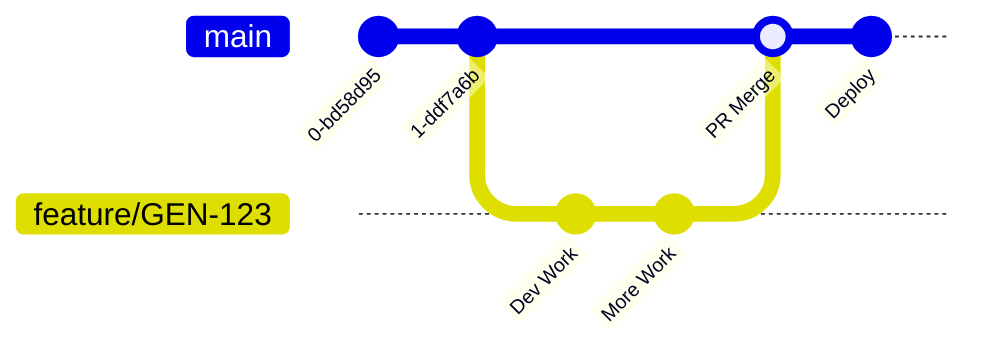
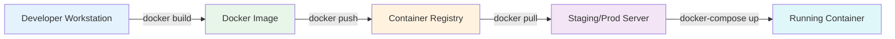

# - Development Workflow

> **Horaion Workforce Management Platform - Development Workflow**


---

## Development Environment

### Local Setup

#### Prerequisites
- Java 21 (JDK)
- Maven 3.9+
- PostgreSQL 12+
- Docker (optional)
- IDE (IntelliJ IDEA, VS Code, Eclipse)

#### Environment Variables
```bash
# Database
DB_PASSWORD=your_password

# AWS Cognito
COGNITO_USER_POOL_ID=us-east-1_xxxxx
COGNITO_CLIENT_ID=xxxxxxxxxxxxx

# Optional
ENGINE_API_URL=https://engine.example.com
```

#### Build & Run
```bash
# Clone repository
git clone <repository-url>
cd horaion-api

# Build
./mvnw clean install

# Run
./mvnw spring-boot:run

# Or with Docker
docker build -t horaion-api .
docker run -p 8080:8080 horaion-api
```

### Development Workflow

### Version Control Strategy (Feature Branch)



> **Diagram Explanation**: This Git graph visualizes our "Feature Branch" workflow. It ensures the main code stays stable while new features are being built.

**The Rules**:
1.  **Main Branch**: The straight line at the bottom. This code is *always* production-ready.
2.  **Feature Branch**: When you start a ticket (GEN-123), you "branch off" (the blue line).
3.  **Work in Isolation**: You make commits (dots) on your blue line. If you break something, `main` is unaffected.
4.  **Merge Back**: Once reviewed, your blue line merges back into the main line, bringing your new feature with it.

---

## CI/CD Pipeline

### Deployment Pipeline (Manual - Bespoke Phase)

**Current Strategy**: Manual Docker Build & Push.



> **Diagram Explanation**: This straightforward pipeline shows how code gets from your laptop to the cloud.

**Step-by-Step Flow**:
1.  **Build (Laptop)**: You run `docker build` to package your code into a "container" (like a shipping container).
2.  **Push (Upload)**: You upload this container to a Registry (like a digital harbor).
3.  **Pull (Server)**: The production server downloads the container from the Registry.
4.  **Run**: The server starts the container, and your app is live.

**Steps**:
1.  **Build**: Developers build the Docker image locally.
    ```bash
    docker build -t horaion-api:latest .
    ```
2.  **Push**: Push to Container Registry (Digital Ocean / AWS ECR).
    ```bash
    docker push horaion-api:latest
    ```
3.  **Deploy**: Pull and restart on the target server (Droplet/Lightsail).
    ```bash
    ssh user@server "docker pull horaion-api:latest && docker-compose up -d"
    ```

**Future CI/CD (SaaS Phase)**:
- **Tool**: GitHub Actions (Recommended)
- **Triggers**: Push to `main`
- **Actions**: Auto-build, Test, Push to Registry, Deploy to Staging.

### Example Pipeline (Template)

```yaml
# Example GitHub Actions workflow
name: CI/CD Pipeline

on:
  push:
    branches: [ main, develop ]
  pull_request:
    branches: [ main ]

jobs:
  build:
    runs-on: ubuntu-latest
    steps:
      - uses: actions/checkout@v3
      - name: Set up JDK 21
        uses: actions/setup-java@v3
        with:
          java-version: '21'
      - name: Build with Maven
        run: ./mvnw clean install
      - name: Run Tests
        run: ./mvnw test
      - name: Build Docker Image
        run: docker build -t horaion-api .
```

---

## Testing Strategy

### Unit Tests
- **Framework**: JUnit 5
- **Coverage Target**: 70% (Recommended)
- **Run Command**: `./mvnw test`

### Integration Tests
- **Framework**: Spring Boot Test
- **Database**: H2 (In-Memory) for Unit tests; TestContainers for Integration.
- **Run Command**: `./mvnw verify`

### API Testing
- **Tool**: Postman Collection (Recommended)
- **Collection**: Maintained in repo under `/docs/postman`

---

## Code Quality

### Linting & Formatting
- **Style Guide**: Enforced via **Checkstyle** (Maven Plugin).
- **Configuration**: Rules defined in `checkstyle.xml`.
- **Run Command**: `./mvnw checkstyle:check`

### Static Analysis & Coverage
- **Qodana**: Static analysis for code quality and security.
  - Run: `./mvnw test` (Triggered via plugin)
- **JaCoCo**: Code coverage reporting.
  - Report Location: `target/site/jacoco/index.html`
  - Min Coverage: **80%** (Enforced by build)

### Code Review Checklist
- [ ] Tests added/updated (Green Build)
- [ ] Coverage met (>80%)
- [ ] No Checkstyle violations
- [ ] No Qodana issues

---

## Next Steps

1. **Document branching strategy**
2. **Set up CI/CD pipeline**
3. **Define testing requirements**
4. **Configure code quality tools**


