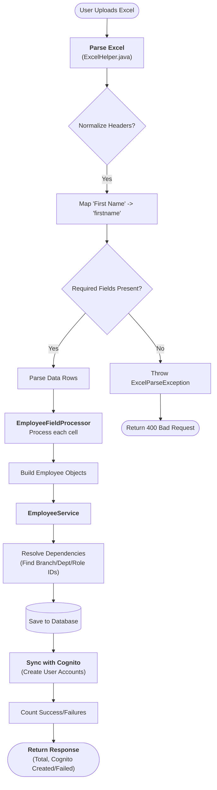
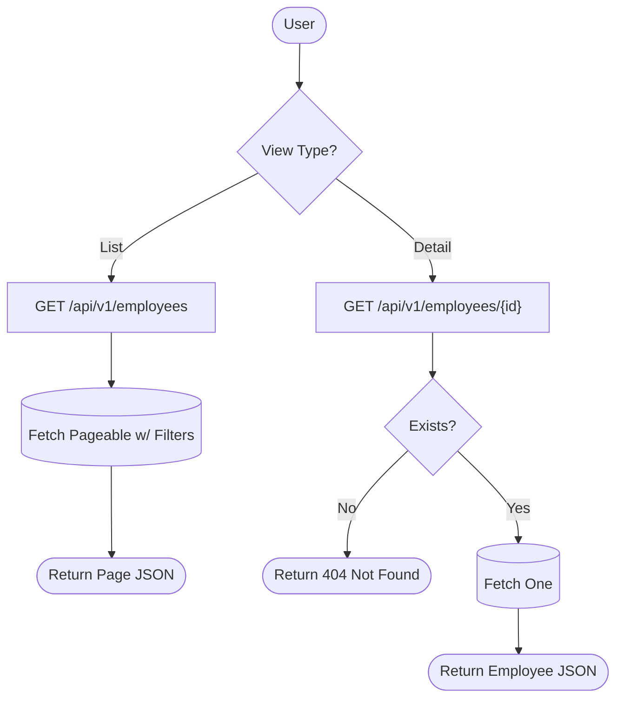
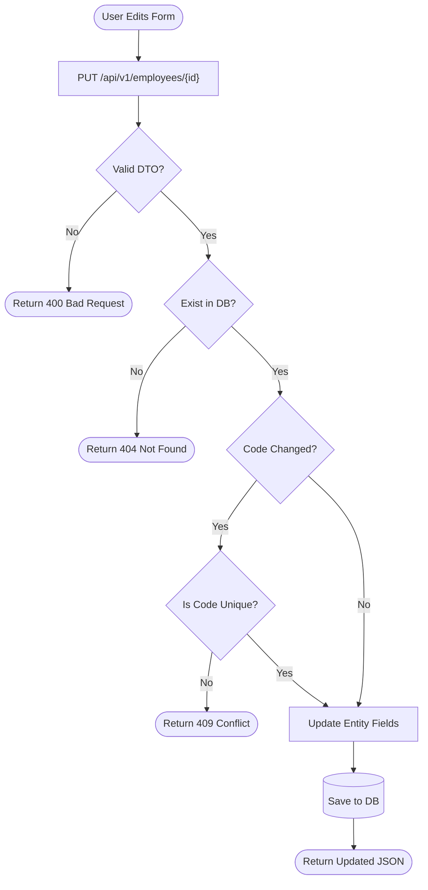
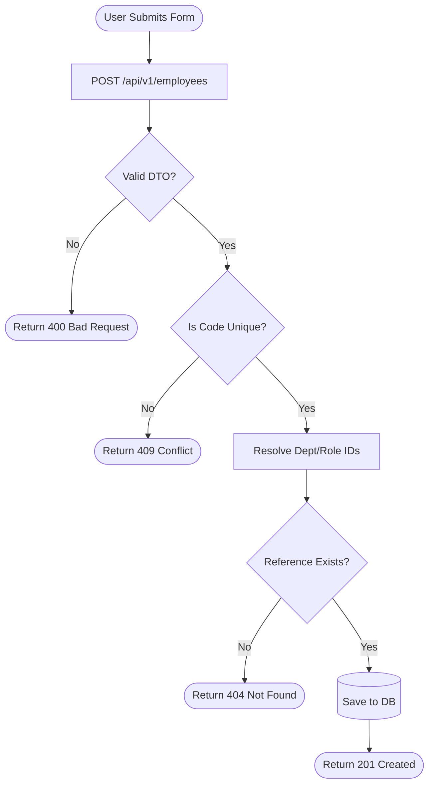

# - Application Flowcharts

> **Horaion Workforce Management Platform - Application Flowcharts**

---

## 12.1 Required Flowcharts

### Excel Uploading Flow

**Description**:
The system allows bulk importing of employees via an Excel file. The process is designed to be robust, handling variable header names and resolving dependencies (Branch, Department, Role) dynamically.

**Header Normalization Explanation**:
> The system "normalizes" headers (stripping spaces, underscores, and converting to lowercase) to improve **User Experience**. This ensures that variations like "First Name", "firstname", or "First_Name" are all accepted as valid, preventing frustration if the user modifies the template slightly.

**Mermaid Flowchart**:

**Key Steps (Visual Walkthrough)**:
1.  **User Uploads Excel**: The user selects a `.xlsx` file on the frontend.
2.  **Parse & Normalize**: The system reads the file. `Norm` checks if headers act weird (e.g. "First_Name"). `MapHeaders` fixes them to "firstname".
3.  **Validate**: `Validate` checks if you missed any required columns. If so, it throws an error immediately.
4.  **Process Rows**: If headers are good, it loops through every row.
5.  **Resolve**: `Resolve` looks up related data (e.g., converts "Sales Dept" text -> Dept ID `123`).
6.  **Save & Sync**: It saves to the DB (`SaveDB`) and then tries to create the user in AWS (`SyncCognito`).
7.  **Response**: Returns the final counts.

---

### Employee View List & Individual

**Description**:
Standard CRUD view flows. The list view supports pagination and filtering, while the detail view fetches by ID.

**Mermaid Flowchart**:

> **Diagram Explanation**: A decision tree for fetching data.

**Visual Walkthrough**:
1.  **View Type?**: The user decides to either "Browse All" or "Click a Profile".
2.  **List Path (Top)**:
    *   **ListReq**: Request hits the List API.
    *   **DB**: The database grabs 20 items (Page 1) and filters them.
    *   **ListResp**: You get a JSON list back.
3.  **Detail Path (Bottom)**:
    *   **DetailReq**: Request hits the Detail API with an ID.
    *   **Exists?**: System checks if ID exists.
    *   **No**: Returns 404 (Not Found).
    *   **Yes**: Returns the single JSON profile.

---

### Employee Update Flow

**Description**:
Updates an existing employee's details.
> **Note**: This process updates the **Database Only**. It does *not* automatically sync changes (like email address) to AWS Cognito in the current version.

**Mermaid Flowchart**:

> **Diagram Explanation**: The safety checks performed when you edit a profile.

**Visual Walkthrough**:
1.  **Valid DTO?**: First, we check the JSON formatting. If you send "Age: Tree", it fails here (400).
2.  **Exist in DB?**: We check if the ID you are updating actually exists. If not, 404.
3.  **Code Changed?**: If you are trying to change the unique "Employee Code", we have to double-check nobody else has it (`Is Code Unique?`).
    *   **No**: 409 Conflict (Duplicate).
    *   **Yes**: Safe to proceed.
4.  **Save**: We update the fields and save to PostgreSQL.

---

### Employee Create Flow (Single)

**Description**:
Creates a single employee record manually.
> **Note**: Unlike the Excel Upload, this endpoint does **not** create a Cognito user account automatically. The employee is created in the database only.

**Mermaid Flowchart**:

> **Diagram Explanation**: Creating a new user manually (one-by-one).

**Visual Walkthrough**:
1.  **Valid DTO?**: Basic JSON check.
2.  **Unique?**: We check if the Employee Code (e.g., EMP-001) is already taken.
3.  **Resolve & Exist**: The big difference here is we check references *strictly*.
    *   If you say "Department ID: 999", we check if Department 999 exists.
    *   If **No**: It breaks immediately (404 Not Found).
4.  **Save**: If all references are valid, we create the record.

---

## 12.2 Additional Workflows (Optional)

### Schedule Generation Flow
(Future Documentation)

### Authentication Flow
(Future Documentation)

---

