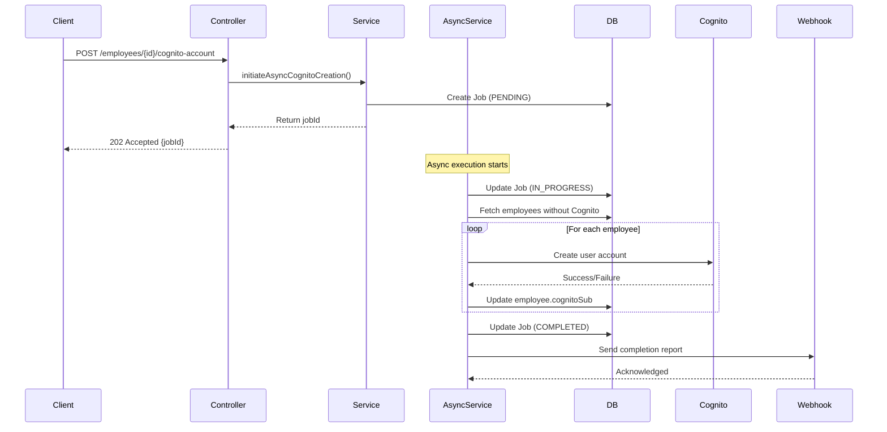

# Horaion API - Expanded Technical Documentation

> **Horaion Workforce Management Platform - Technical Deep Dive**

This document provides detailed technical information about Horaion implementation patterns.

---

## Table of Contents

1. [Asynchronous Processing](#asynchronous-processing)
2. [External Service Integration](#external-service-integration)
3. [Database Connection Management](#database-connection-management)
4. [Web Server Configuration](#web-server-configuration)
5. [Data Mapping Patterns](#data-mapping-patterns)
6. [Transaction Management](#transaction-management)
7. [Cognito Account Creation Workflow](#cognito-account-creation-workflow)

---

## Asynchronous Processing

### Thread Pool Configuration

Horaion implements **two dedicated thread pools** for different types of asynchronous operations.

#### 1. Schedule Task Executor

**Purpose**: Handles long-running schedule generation operations (15-30 minutes)

**Configuration** (`AsyncConfiguration.java`):
```java
@Bean(name = "scheduleTaskExecutor")
public Executor scheduleTaskExecutor() {
    ThreadPoolTaskExecutor executor = new ThreadPoolTaskExecutor();
    executor.setCorePoolSize(5);           // 5 threads always active
    executor.setMaxPoolSize(20);           // Scale up to 20 threads
    executor.setQueueCapacity(100);        // Queue up to 100 tasks
    executor.setThreadNamePrefix("Schedule-Async-");
    executor.setKeepAliveSeconds(60);      // Idle threads timeout after 60s
    return executor;
}
```

**Thread Naming**: `Schedule-Async-1`, `Schedule-Async-2`, etc.

**Rejection Policy**: Throws `RuntimeException` when queue is full (100 tasks)

**Use Cases**:
- Schedule generation via optimization engine
- Bulk schedule operations

#### 2. General Task Executor

**Purpose**: Handles shorter async operations (Cognito account creation, webhooks)

**Configuration**:
```java
@Bean(name = "generalTaskExecutor")
public Executor generalTaskExecutor() {
    ThreadPoolTaskExecutor executor = new ThreadPoolTaskExecutor();
    executor.setCorePoolSize(3);           // 3 threads always active
    executor.setMaxPoolSize(10);           // Scale up to 10 threads
    executor.setQueueCapacity(50);         // Queue up to 50 tasks
    executor.setThreadNamePrefix("General-Async-");
    executor.setKeepAliveSeconds(60);
    return executor;
}
```

**Thread Naming**: `General-Async-1`, `General-Async-2`, etc.

**Use Cases**:
- Cognito account creation (bulk operations)
- Webhook notifications
- Email sending

### Async Method Usage

**Example from `CognitoAccountCreationService`**:
```java
@Async
@Transactional
public void processAsyncCognitoCreation(String jobId) {
    // Runs in generalTaskExecutor thread pool
    // Transaction managed per async method
}
```

**Key Points**:
- `@Async` methods run in separate threads
- Each async method gets its own transaction context
- Return type must be `void` or `Future<T>`
- Caller gets immediate response while processing continues

---

## External Service Integration

### Feign Client Configuration

Horaion uses **Feign** for HTTP client communication with the external optimization engine.

#### Timeout Configuration

**Problem**: Schedule generation takes 15-30 minutes  
**Solution**: Extended timeouts to 45 minutes

**Configuration** (`FeignConfiguration.java`):
```java
@Bean
public Request.Options feignRequestOptions() {
    int timeoutMs = 2700000;  // 45 minutes in milliseconds
    
    return new Request.Options(
        timeoutMs,  // connectTimeout: 45 minutes
        timeoutMs,  // readTimeout: 45 minutes
        true        // followRedirects
    );
}
```

**Why 45 minutes?**
- Engine typically takes 15-30 minutes
- 45 minutes provides buffer for edge cases
- Prevents premature timeout failures

#### Retry Configuration

**Configuration**:
```java
@Bean
public Retryer feignRetryer() {
    return Retryer.NEVER_RETRY;  // Retries disabled
}
```

**Why no retries?**
- Schedule generation is **idempotent-sensitive**
- Retrying a 15-30 minute operation could create duplicate schedules
- Engine maintains its own state
- Better to fail fast and let user retry manually

#### Error Handling

**Custom Error Decoder**:
```java
@Bean
public ErrorDecoder feignErrorDecoder() {
    return (methodKey, response) -> {
        LOGGER.warn("Feign client error for method {}: HTTP {} - {}",
                   methodKey, response.status(), response.reason());
        
        return new ErrorDecoder.Default().decode(methodKey, response);
    };
}
```

**Logs all Feign errors** with method name, HTTP status, and reason.

---

## Database Connection Management

### HikariCP Configuration

Horaion uses **HikariCP** for high-performance connection pooling with database-specific optimizations.

#### Default Pool Settings

**Configuration** (`DatabaseConfiguration.java`):
```java
// Pool sizing
maximumPoolSize: 10
minimumIdle: 10

// Timeouts
connectionTimeout: 30,000ms  (30 seconds)
idleTimeout: 600,000ms       (10 minutes)
maxLifetime: 1,800,000ms     (30 minutes)

// Behavior
autoCommit: false            (managed by @Transactional)
readOnly: false
```

**Pool Name**: `Horaion-HikariCP-{profile}` (e.g., `Horaion-HikariCP-prod`)

#### PostgreSQL-Specific Optimizations

**Applied automatically when using PostgreSQL**:
```java
private void applyPostgreSQLOptimizations(HikariConfig config) {
    config.addDataSourceProperty("tcpKeepAlive", "true");
    config.addDataSourceProperty("ApplicationName", "Horaion-Application-{profile}");
    config.addDataSourceProperty("assumeMinServerVersion", "12.0");
    config.addDataSourceProperty("reWriteBatchedInserts", "true");
    
    // Prepared statement caching
    config.addDataSourceProperty("prepareThreshold", "5");
    config.addDataSourceProperty("preparedStatementCacheQueries", "250");
    config.addDataSourceProperty("preparedStatementCacheSizeMiB", "5");
    
    config.addDataSourceProperty("maintainTimeStats", "false");
}
```

**Benefits**:
- **tcpKeepAlive**: Prevents connection drops on idle connections
- **reWriteBatchedInserts**: Optimizes batch INSERT performance
- **Prepared Statement Caching**: Caches up to 250 prepared statements (5MB)
- **assumeMinServerVersion**: Enables PostgreSQL 12+ features

#### Monitoring Integration

**Micrometer Metrics** (if MeterRegistry available):
```java
private void applyMonitoring(HikariConfig config) {
    meterRegistry.ifPresent(reg -> {
        config.setMetricsTrackerFactory(new MicrometerMetricsTrackerFactory(reg));
    });
}
```

**Available Metrics**:
- `hikaricp.connections.active`: Active connections
- `hikaricp.connections.idle`: Idle connections in pool
- `hikaricp.connections.pending`: Threads waiting for connection
- `hikaricp.connections.timeout`: Connection acquisition timeouts
- `hikaricp.connections.total`: Total connections
- `hikaricp.connections.max`: Maximum pool size
- `hikaricp.connections.min`: Minimum idle connections

#### Password Resolution

**Priority order** (first found wins):
1. Environment variable: `DB_PASSWORD`
2. System property: `db.password`
3. Application property: `app.database.password`

```java
private String getResolvedPassword() {
    if (StringUtils.hasText(System.getenv("DB_PASSWORD"))) {
        return System.getenv("DB_PASSWORD");
    }
    if (StringUtils.hasText(System.getProperty("db.password"))) {
        return System.getProperty("db.password");
    }
    return databaseProperties.getPassword();
}
```

**Security**: Passwords are masked in logs using regex replacement.

---

## Web Server Configuration

### Timeout Configuration

Horaion configures **unlimited timeouts** at multiple levels to support long-running operations.

#### Spring MVC Async Support

**Configuration** (`WebServerConfiguration.java`):
```java
@Override
public void configureAsyncSupport(AsyncSupportConfigurer configurer) {
    configurer.setDefaultTimeout(-1L);  // -1 = unlimited
}
```

#### Tomcat Connector Settings

**Configuration**:
```java
factory.addConnectorCustomizers(connector -> {
    connector.setProperty("connectionTimeout", "0");    // Unlimited
    connector.setProperty("keepAliveTimeout", "0");     // Unlimited
    connector.setProperty("asyncTimeout", "0");         // Unlimited
    
    connector.setProperty("maxConnections", "8192");    // Max connections
    connector.setProperty("acceptCount", "100");        // Queue length
    connector.setProperty("maxThreads", "200");         // Thread pool size
    connector.setProperty("minSpareThreads", "10");     // Min threads
});
```

**Why unlimited timeouts?**
- Schedule generation: 15-30 minutes
- Feign calls to engine: 45-minute timeout
- Prevents premature connection termination
- Client controls timeout, not server

**Connection Limits**:
- **8,192 max connections**: Supports high concurrency
- **200 threads**: Handles 200 concurrent requests
- **100 accept queue**: Buffers incoming connections

---

## Data Mapping Patterns

### Mapper Architecture

Horaion uses **dedicated mapper classes** for DTO ↔ Entity conversion (11 mappers total).

#### Mapper Responsibilities

**Each mapper provides 3 methods**:
1. `toResponseDTO(Entity)` - Entity → Response DTO
2. `toEntity(RequestDTO)` - Request DTO → Entity (for creation)
3. `updateEntity(Entity, RequestDTO)` - Update existing entity

#### Example: Employee Mapper

**File**: `EmployeeMapper.java`

**1. Entity to Response DTO**:
```java
public EmployeeResponseDTO toEmployeeResponseDTO(Employee employee) {
    return new EmployeeResponseDTO(
        employee.getId(),
        employee.getDepartment().getId(),
        employee.getDepartment().getDepartmentName(),
        employee.getDepartment().getBranch().getBranchName(),  // Nested navigation
        employee.getDepartment().getBranch().getCompany().getName(),
        employee.getEmployeeRole().getId(),
        employee.getEmployeeRole().getName(),
        employee.getEmployeeCode(),
        employee.getPhoneNumber(),
        employee.getFirstName(),
        employee.getLastName(),
        employee.getEmailAddress(),
        employee.getRoleProficiency(),
        employee.getIsPartTime(),
        employee.getEndOfProbation(),
        employee.getAvailability(),
        employee.getIsActive(),
        employee.getAdditionalFields(),
        employee.getCreatedAt(),
        employee.getUpdatedAt()
    );
}
```

**Key Features**:
- **Null-safe navigation**: Checks for null before accessing nested properties
- **Denormalized data**: Includes department name, branch name, company name
- **Flattened structure**: Nested entities flattened into single DTO

**2. Request DTO to Entity**:
```java
public Employee toEmployeeEntity(EmployeeRequestDTO request) {
    Employee employee = new Employee();
    employee.setEmployeeCode(request.employeeCode());
    employee.setFirstName(request.firstName());
    employee.setLastName(request.lastName());
    employee.setEmailAddress(request.emailAddress());
    employee.setIsActive(request.isActive() == null || request.isActive());  // Default true
    // ... other fields
    return employee;
}
```

**Note**: Does NOT set relationships (department, role) - handled by service layer.

**3. Update Existing Entity**:
```java
public void updateEmployeeEntity(Employee employee, EmployeeRequestDTO request) {
    employee.setEmployeeCode(request.employeeCode());
    employee.setFirstName(request.firstName());
    // Preserve existing value if request value is null
    employee.setRoleProficiency(
        request.roleProficiency() != null 
            ? request.roleProficiency() 
            : employee.getRoleProficiency()
    );
    // ... other fields
}
```

**Partial Update Support**: Null values in request preserve existing entity values.

### All Mappers

| Module | Mapper Class | Entity | Request DTO | Response DTO |
|--------|--------------|--------|-------------|--------------|
| Employee | EmployeeMapper | Employee | EmployeeRequestDTO | EmployeeResponseDTO |
| Department | DepartmentMapper | Department | DepartmentRequestDTO | DepartmentResponseDTO |
| Branch | BranchMapper | Branch | BranchRequestDTO | BranchResponseDTO |
| Company | CompanyMapper | Company | CompanyRequestDTO | CompanyResponseDTO |
| Schedule | ScheduleMapper | Schedule | ScheduleRequestDTO | ScheduleResponseDTO |
| Shift | ShiftMapper | Shift | ShiftRequestDTO | ShiftResponseDTO |
| Rule | RuleMapper | Rule | RuleRequestDTO | RuleResponseDTO |
| RuleAnswer | RuleAnswerMapper | RuleAnswer | RuleAnswerRequestDTO | RuleAnswerResponseDTO |
| DemandForecast | DemandForecastMapper | DemandForecast | DemandForecastRequestDTO | DemandForecastResponseDTO |
| EmployeeRole | EmployeeRoleMapper | EmployeeRole | EmployeeRoleRequestDTO | EmployeeRoleResponseDTO |
| EmployeeLeaveAvailability | EmployeeLeaveAvailabilityMapper | EmployeeLeaveAvailability | EmployeeLeaveAvailabilityRequestDTO | EmployeeLeaveAvailabilityResponseDTO |

---

## Transaction Management

### @Transactional Usage

Horaion uses Spring's `@Transactional` annotation for declarative transaction management.

#### Service-Level Transactions

**All service methods are transactional**:
```java
@Service
public class EmployeeService {
    
    @Transactional
    public EmployeeResponseDTO createEmployee(EmployeeRequestDTO request) {
        // Entire method runs in single transaction
        // Automatic rollback on exception
    }
    
    @Transactional(readOnly = true)
    public EmployeeResponseDTO getEmployeeById(Long id) {
        // Read-only transaction (optimization)
    }
}
```

#### Transaction Characteristics

**Default Settings**:
- **Propagation**: `REQUIRED` (join existing or create new)
- **Isolation**: `READ_COMMITTED` (PostgreSQL default)
- **Rollback**: Automatic on `RuntimeException` and `Error`
- **Timeout**: None (unlimited)

**Read-Only Optimization**:
```java
@Transactional(readOnly = true)
```
- Hints to database that no writes will occur
- Allows database optimizations
- Prevents accidental modifications

#### Async + Transactional

**Each async method gets its own transaction**:
```java
@Async
@Transactional
public void processAsyncCognitoCreation(String jobId) {
    // New transaction created for this async execution
    // Independent of caller's transaction
}
```

**Important**: Async methods cannot participate in caller's transaction.

---

## Cognito Account Creation Workflow

### Async Job Processing

Horaion implements a **job-based async pattern** for bulk Cognito account creation.

#### Workflow Overview



> **Diagram Explanation**: The robust definition of the bulk creation job: tracking the lifecycle from 'Pending' to 'Completed', handling individual successes/failures, and notifying external systems via webhooks.


#### Job Entity

**Table**: `cognito_creation_jobs`

**Fields**:
- `job_id`: UUID identifier
- `status`: PENDING | IN_PROGRESS | COMPLETED | FAILED
- `total_employees`: Total count
- `successful_creations`: Success count
- `failed_creations`: Failure count
- `skipped_existing`: Already had Cognito account
- `start_time`: Job start timestamp
- `end_time`: Job completion timestamp
- `webhook_url`: Optional callback URL
- `webhook_notified`: Boolean flag

#### Implementation Details

**1. Initiate Job**:
```java
public String initiateAsyncCognitoCreation(List<Long> employeeIds, String webhookUrl) {
    String jobId = UUID.randomUUID().toString();
    
    CognitoCreationJob job = new CognitoCreationJob();
    job.setJobId(jobId);
    job.setStatus(JobStatus.PENDING);
    job.setTotalEmployees(employeeIds.size());
    job.setWebhookUrl(webhookUrl);
    
    jobRepository.save(job);
    return jobId;
}
```

**2. Process Async** (runs in `generalTaskExecutor`):
```java
@Async
@Transactional
public void processAsyncCognitoCreation(String jobId) {
    CognitoCreationJob job = jobRepository.findByJobId(jobId).orElseThrow();
    
    try {
        job.setStatus(JobStatus.IN_PROGRESS);
        job.setStartTime(Instant.now());
        jobRepository.save(job);
        
        List<Employee> employees = employeeRepository.findAll().stream()
            .filter(emp -> emp.getCognitoSub() == null || emp.getCognitoSub().isBlank())
            .toList();
        
        int successful = 0, failed = 0, skipped = 0;
        List<CognitoCreationResultDTO> results = new ArrayList<>();
        
        for (Employee employee : employees) {
            CognitoCreationResultDTO result = createCognitoAccount(employee);
            results.add(result);
            
            if (result.isSuccess()) successful++;
            else if ("ALREADY_EXISTS".equals(result.getErrorType())) skipped++;
            else failed++;
        }
        
        job.setStatus(JobStatus.COMPLETED);
        job.setEndTime(Instant.now());
        job.setSuccessfulCreations(successful);
        job.setFailedCreations(failed);
        job.setSkippedExisting(skipped);
        jobRepository.save(job);
        
        // Send webhook notification
        webhookService.sendCognitoCreationReport(report, job);
        
    } catch (Exception e) {
        job.setStatus(JobStatus.FAILED);
        jobRepository.save(job);
    }
}
```

**3. Webhook Notification**:
```json
{
  "jobId": "a1b2c3d4-e5f6-7890-abcd-ef1234567890",
  "startTime": "2026-02-02T10:00:00Z",
  "endTime": "2026-02-02T10:05:30Z",
  "totalEmployees": 100,
  "successfulCreations": 95,
  "failedCreations": 3,
  "skippedExisting": 2,
  "results": [
    {
      "employeeId": 1,
      "employeeCode": "EMP001",
      "success": true,
      "cognitoSub": "a1b2c3d4-..."
    },
    {
      "employeeId": 2,
      "employeeCode": "EMP002",
      "success": false,
      "errorType": "INVALID_EMAIL",
      "errorMessage": "Email format invalid"
    }
  ]
}
```

#### Default Temporary Password

**Constant**: `Password123!`

**Used for**: Initial Cognito account creation (user must change on first login)

---

## Summary

This expanded documentation covers:

✅ **Async Processing**: 2 thread pools with specific configurations  
✅ **Feign Integration**: 45-minute timeouts, no retries  
✅ **Database**: HikariCP with PostgreSQL optimizations  
✅ **Web Server**: Unlimited timeouts for long operations  
✅ **Mappers**: 11 mappers with consistent patterns  
✅ **Transactions**: Service-level @Transactional usage  
✅ **Cognito Workflow**: Complete async job processing pattern  

All content verified from actual codebase implementation.
