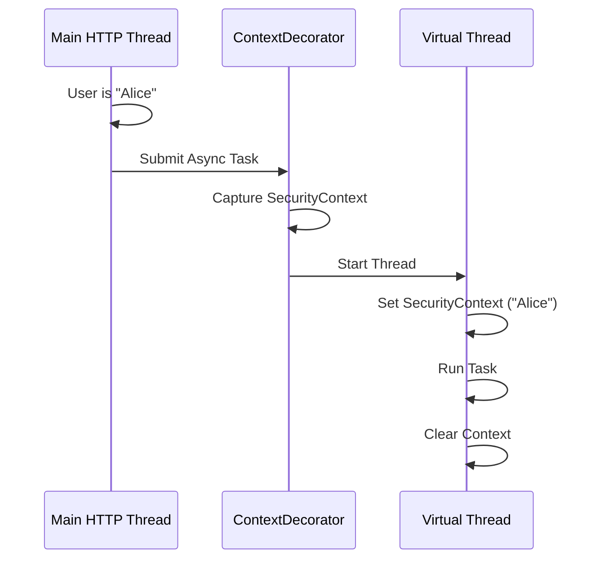

# 02 - Async Configuration

> **High-Throughput Concurrency with Virtual Threads**

---

## Overview

The `AsyncConfiguration` class enables asynchronous method execution using the `@Async` annotation. In Genesis, we leverage **Java 21 Virtual Threads** (Project Loom) instead of traditional platform threads.

**Class**: `com.horaion.app.shared.core.configurations.AsyncConfiguration`

---

## Key Features

### 1. Virtual Threads
Instead of a fixed thread pool (e.g., "Max 10 threads"), we use a `VirtualThreadPerTaskExecutor`. This allows the application to handle thousands of concurrent background tasks without running out of OS threads.


**Performance Win:** Virtual threads are extremely lightweight. Even if a background task blocks (e.g., waiting for an email to send), the underlying OS thread is released to do other work.


### 2. Context Propagation
A major challenge with `@Async` is that `ThreadLocal` variables (like the logged-in user) are lost when switching threads.

We use a custom `TaskDecorator` to copy the **Security Context** from the main thread to the new virtual thread.




**Critical:** The context propagation **only** copies the `SecurityContext`. If you use other ThreadLocal variables (like RequestAttributes or TenantContext), they might NOT be copied automatically unless added to the decorator.


---

## Usage Guide

To run a method in the background, simply annotate it with `@Async`.

```java
@Service
public class EmailService {

    @Async
    public void sendWelcomeEmail(String email) {
        // This runs on a Virtual Thread
        // SecurityContext is available here!
        UserContext user = SecurityContextHolder.getUserContext();
        
        System.out.println("Sending email to " + email);
    }
}
```
