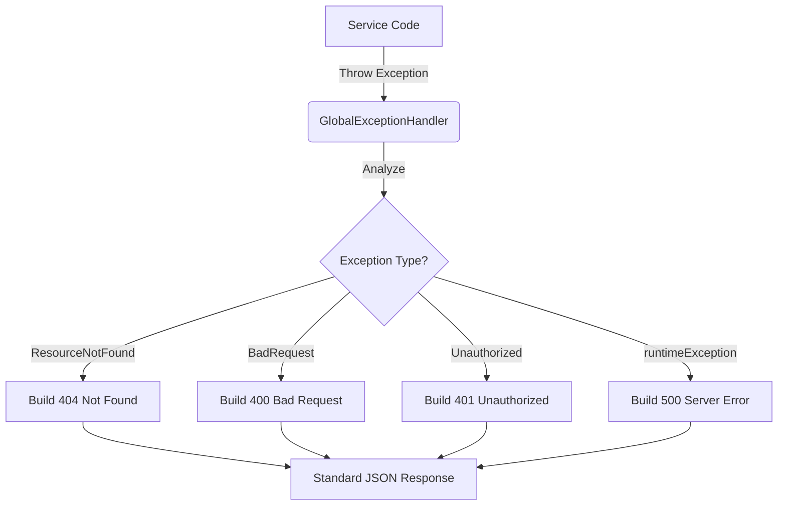

# 04 - Core Exceptions

> **Global Error Handling Strategy**

A robust API must have a predictable error strategy. We do **not** return random stack traces to the client. Instead, we conform to the **RFC 7807 Problem Details** standard.

---

## Error Handling Flow

The following diagram illustrates how an exception travels from the depth of the code to the user.



---

## 1. The Hierarchy (`BaseException`)
**File**: [`BaseException.java`](file:///home/moses/genesis/api_app/horaion/src/main/java/com/horaion/app/shared/core/exceptions/BaseException.java)

All custom exceptions in Horaion extend this abstract class. This allows us to enforce that every custom exception *must* provide a user-friendly message.

### Common Subclasses

| Exception | HTTP Status | Use Case |
| :--- | :--- | :--- |
| `ResourceNotFoundException` | **404** | "Employee with ID 5 does not exist." |
| `BadRequestException` | **400** | "Start date cannot be after End date." |
| `ConflictException` | **409** | "Email address is already in use." |
| `ForbiddenException` | **403** | "Manager cannot view Admin logs." |


**Tip:** Always prefer throwing a specific exception (e.g., `ResourceNotFoundException`) over a generic `RuntimeException`. This helps the `GlobalExceptionHandler` pick the right HTTP Status Code.


---

## 2. Global Exception Handler
**File**: [`GlobalExceptionHandler.java`](file:///home/moses/genesis/api_app/horaion/src/main/java/com/horaion/app/shared/security/handlers/GlobalExceptionHandler.java)

This class uses Spring's `@RestControllerAdvice` to act as a "Catch-All" net.

### The Problem Detail Format
When an error occurs, the client receives a structured JSON:

```json
{
  "type": "about:blank",
  "title": "Resource Not Found",
  "status": 404,
  "detail": "Shift template with UUID 'abc-123' not found.",
  "instance": "/api/v1/shifts/abc-123",
  "timestamp": "2023-10-27T10:00:00Z"
}
```


**Critical:** Never swallow exceptions in your Service code with an empty `catch` block. If you catch an exception, either handle it properly or rethrow it wrapped in a `BaseException`.

