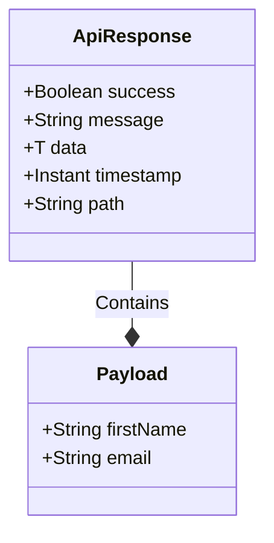

# 08 - Core Responses

> **The Public Face of the API**

To maintain a professional Frontend Developer Experience (DX), consistency is key. Every single API endpoint in Horaion returns data wrapped in a predictable "Envelope".

---

## 1. The Wrapper (`ApiResponse`)
**File**: ``ApiResponse.java``

This is the standard envelope. Whether you fetch a User, a Shift, or a Report, the outside box always looks the same.

### Visual Structure



### JSON Example
```json
{
  "success": true,
  "message": "User profile retrieved successfully",
  "timestamp": "2023-10-27T10:30:15.123Z",
  "path": "/api/v1/me",
  "data": {
     "firstName": "John",
     "email": "john@horaion.com"
  }
}
```


**Important:** The frontend expects the `data` field to be generic. Do not add random top-level fields like `count` or `status` outside this structure.


---

## 2. Paged Response (`PagedResponse`)
**File**: ``PagedResponse.java``

Used for lists of data. Spring Data's default `PageImpl` object is extremely verbose (containing internal implementation details). We map it to this simplified view.

### Fields
*   `content`: List of items `<T>`.
*   `page`: Current page number (0-indexed).
*   `size`: Items per page.
*   `totalElements`: Total count in database (for calculating "Page 1 of X").


**Tip:** Always use the `PagedResponse.of(Page<T> page)` factory method to convert a Spring Page object into this response automatically.

