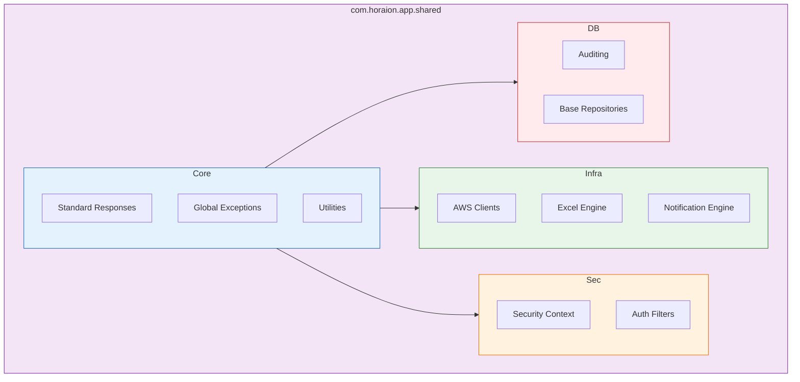

# 01 - Shared Kernel Overview

> **Common Components & Infrastructure for the Genesis Platform**

---

## Introduction

The **Shared Kernel** (`com.horaion.app.shared`) is the backbone of the Genesis application. It provides a robust set of reusable components, infrastructure adapters, and standardized patterns that all feature modules must use.

**Why a Shared Kernel?**
Instead of duplicating logic in every module (like "how to send an email" or "how to format a JSON error"), we centralize these concerns here. This ensures:
1.  **Consistency**: Every API endpoint returns the same JSON structure.
2.  **Maintainability**: Fix a bug in the Email Service, and it's fixed everywhere.
3.  **Speed**: Developers focus on business logic (`ShiftService`), not plumbing (`S3Client`).

---

## Architecture

The Shared Kernel is organized into distinct layers, mirroring the application's clean architecture:



> **Diagram Explanation**:
> *   **Core**: The most fundamental classes (Enums, Constants, API Wrappers).
> *   **Infrastructure**: Heavy-lifting implementation for external tools (AWS, Email).
> *   **Security**: Cross-cutting security concern implementation.
> *   **Database**: JPA extensions and standardized data access patterns.

---

## Package Structure

```
com.horaion.app.shared
├── core/               # Domain-agnostic POJOs and Utilities
│   ├── responses/      # Standardized API response envelopes
│   ├── exceptions/     # Global exception hierarchy
│   └── constants/      # System-wide constants
├── infrastructure/     # Implementation of external adapters
│   ├── aws/            # AWS SDK wrappers (S3, Cognito, SES)
│   ├── notification/   # Email and message dispatching
│   └── excel/          # Apache POI wrappers for import/export
├── security/           # Application security configuration
│   ├── context/        # User context holderes
│   └── filters/        # JWT and Request filters
└── database/           # Persistence extensions
    ├── audit/          # JPA Auditing (CreatedBy, UpdatedAt)
    └── repositories/   # Base repository interfaces
```

---

## Guiding Principles

### 1. No Business Logic
The Shared Kernel **never** contains business rules (e.g., "A shift cannot be longer than 8 hours"). It only contains *capabilities* (e.g., "Here is how you calculate the difference between two timestamps").

### 2. Standardization
If a pattern is used in more than one module, it belongs here.
*   **Bad**: `ShiftController` defines its own `ErrorResponse` class.
*   **Good**: `ShiftController` uses `shared.core.responses.ErrorResponse`.

### 3. Dependency Rule
The Shared Kernel should have minimal dependencies on the rest of the application. It is the *foundation*, not the *roof*. Feature modules depend on Shared; Shared does not depend on Feature modules.
