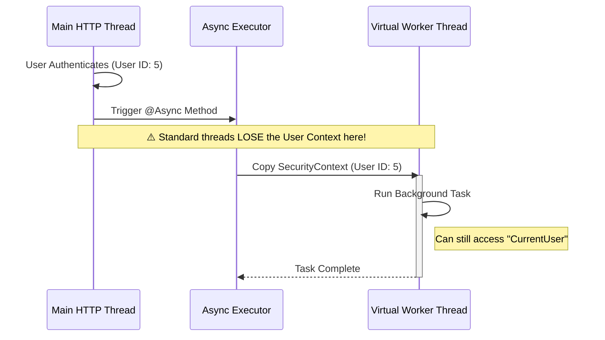

# 01 - Core Configurations

> **Infrastructure settings for the Application Context**

Typically, a Spring Boot application requires global settings that apply to all modules. Instead of scattering these settings across random files, we centralize them in the `shared.core.configurations` package.

---

## 1. Async Configuration
**File**: ``AsyncConfiguration.java``

This configuration powers the `@Async` annotation, allowing methods to run in a separate thread (fire-and-forget).

### Why is this important?
By default, Spring's `@Async` uses a simple thread pool. However, in our architecture, we need two advanced features:
1.  **Virtual Threads**: Leveraging Java 21's lightweight threads for high-throughput concurrency.
2.  **Context Propagation**: Ensuring that the "Logged In User" context (`SecurityContext`) is passed from the main thread to the background thread.

### Thread Model Visualization



> **Diagram Explanation**: This sequence visualization shows the lifecycle of an asynchronous request:
> 1.  **Context Capture**: In the Main HTTP Thread, the user's security identity is established.
> 2.  **Hand-off**: When an `@Async` method is called, the custom executor "checks out" a worker thread (often a Virtual Thread in Java 21).
> 3.  **Propagation**: The executor explicitly copies the `SecurityContext` into the worker's thread-local storage. This is critical for data-level security checks performed in background tasks.


**Success:** This pattern allows us to perform background auditing, send tenant-specific emails, and execute secured business logic without complex manual context management.


### Visual Walkthrough
1.  **Authentication**: The request starts on a standard Tomcat thread using the User's credentials.
2.  **Context Loss Risk**: When we fire an asynchronous task, it usually runs on a *new* thread (the "Worker"). By default, this new thread is blank—it doesn't know who the user is.
3.  **Propagation**: Our Custom Executor intervenes. It captures the `SecurityContext` from the Main thread and *injects* it into the Worker thread.
4.  **Result**: The background task can safely call methods like `SecurityContextHolder.getContext().getAuthentication()` and get the correct User ID, enabling audit logging and security checks to work seamlessly.

### Key Implementation Details


**Note:** We use `DelegatingSecurityContextAsyncTaskExecutor`. This wrapper is the magic component that copies the security context to the new thread. Without this, calling `SecurityContextHolder.getContext()` in an async method would return `null`.


```java
@Bean
public Executor taskExecutor() {
    ThreadPoolTaskExecutor executor = new ThreadPoolTaskExecutor();
    executor.setCorePoolSize(10); 
    // ... logic to enable Virtual Threads
    return new DelegatingSecurityContextAsyncTaskExecutor(executor);
}
```

---

## 2. Jackson Configuration
**File**: ``JacksonConfiguration.java``

This class configures the `ObjectMapper`, which is the engine Spring uses to convert Java Objects to JSON (and vice versa).

### The "Dates" Problem
By default, Java's `LocalDateTime` might serialize as an array of numbers: `[2023, 10, 5, 14, 30]`. This is terrible for Frontend Apps to parse.

**Our Standard**: **ISO-8601 Strings**
*   **Format**: `yyyy-MM-dd'T'HH:mm:ss.SSS'Z'`
*   **Example**: `"2023-10-05T14:30:00.000Z"`


**Critical:** Never override the `ObjectMapper` in your own modules unless absolutely necessary. Relying on this global default ensures that Date/Time formats are consistent across every single API endpoint in the platform.


### Features Enabled
*   `WRITE_DATES_AS_TIMESTAMPS = false`: Forces String format instead of numeric timestamps.
*   `FAIL_ON_UNKNOWN_PROPERTIES = false`: Makes the API robust. If the frontend sends an extra field we usually simply ignore it rather than crashing.
*   `NON_NULL` Serialization: We do not send `field: null` in JSON responses to save bandwidth.
