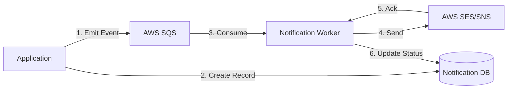

# 01 - Notification Overview

> **Reliable, Asynchronous Messaging Engine**

---

## Architecture

The Notification Engine is designed to decouple business logic (e.g., "Shift Created") from message delivery (e.g., "Send Email"). It uses an **Event-Driven Architecture** backed by AWS SQS and a persistent Outbox pattern.

### Flow Walkthrough
1.  **Emit Event**: The application (e.g., Shift Service) publishes a lightweight event message to an **AWS SQS** queue. This happens asynchronously, so the user doesn't wait for the email to be sent.
2.  **Create Record**: Simultaneously, the application saves a `NotificationRecord` in the database with a status of `PENDING`. This acts as our "Outbox" for audit purposes.
3.  **Consume**: A dedicated background **Worker** picks up the message from the queue.
4.  **Send**: The worker calls the external **AWS Service** (SES for Email, SNS for SMS) to actually deliver the message.
5.  **Ack**: AWS confirms receipt of the request.
6.  **Update Status**: The worker updates the `NotificationRecord` in the database to `SENT` or `FAILED`.

---

## Key Components

| Component | Responsibility |
| :--- | :--- |
| **SQS Queues** | Buffers high-volume events (`notification.queues.email`, `notification.queues.sms`). |
| **Workers** | Background listeners (@SqsListener) that process messages. |
| **Tracking Service** | Manage the lifecycle of a notification in the database. |

---

## Data Model
The `NotificationRecord` entity stores the full history of every message sent by the system.

*   **Correlation ID**: Links the notification to the original domain event.
*   **Provider Message ID**: The ID returned by AWS (e.g., SES Message ID), used for tracking delivery receipts/bounces.
*   **Status Lifecycle**: `PENDING` -> `SENT` -> `DELIVERED` (or `FAILED`/`BOUNCED`).


**Reliability:** SQS ensures that if the worker fails (e.g., network error), the message remains in the queue and is retried automatically.

