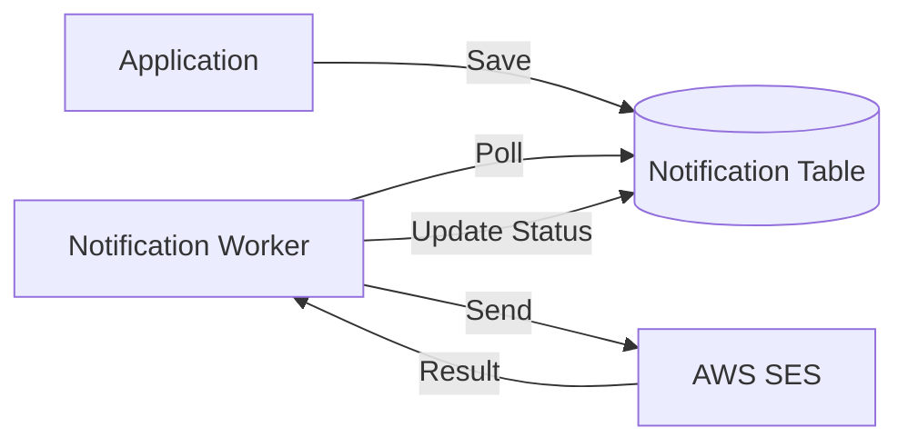

# 03 - Shared Infrastructure

> **External Integrations and Background Processing**

---

## 3.1 AWS Integration
**Package**: `com.horaion.app.shared.infrastructure.aws`

This package wraps the AWS SDK 2.x to provide opinionated, easy-to-use clients for our cloud resources.

### Components
*   **Cognito**: `LocalCognitoClient` (for dev) and `AwsCognitoClient` (prod). abstracting user pool operations.
*   **SES (Simple Email Service)**: Handles raw email dispatch.
*   **SNS (Notification Service)**: Wrapper for publishing domain events to topics.

---

## 3.2 Notification Engine
**Package**: `com.horaion.app.shared.infrastructure.notification`

The most complex component in Shared Kernel, this engine handles the reliable delivery of messages (Email, Push, SMS) to users.

### Architecture
It uses an **Outbox Pattern** combined with background workers to ensure notifications are never lost, even if the external provider (AWS) is temporarily down.

1.  **Notification Entity**: When a system event happens (e.g., "Shift Published"), the app saves a `Notification` record to the database with status `PENDING`.
2.  **Workers**: Background threads (`NotificationWorker`) poll for pending notifications.
3.  **Dispatch**: The worker picks up the notification, renders the content (using templates), and sends it via the `NotificationSender` interface (e.g., SES).
4.  **Retry**: If standard delivery fails, the worker uses an exponential backoff strategy (up to 3 times) before marking it `FAILED`.

---

## 3.3 Excel Engine
**Package**: `com.horaion.app.shared.infrastructure.excel`

Wraps **Apache POI** to provide simplified Import/Export capabilities, heavily used by the **Employee Module**.

### Features
*   **Streaming Reader**: Efficiently reads large spreadsheets row-by-row to avoid `OutOfMemoryError`.
*   **Annotation-based Mapping**: Maps Excel columns to Java DTO fields using custom annotations (e.g., `@ExcelColumn("Email Address")`).
*   **Validation**: Performs data type checks and row-level validation before returning the parsed object list.
