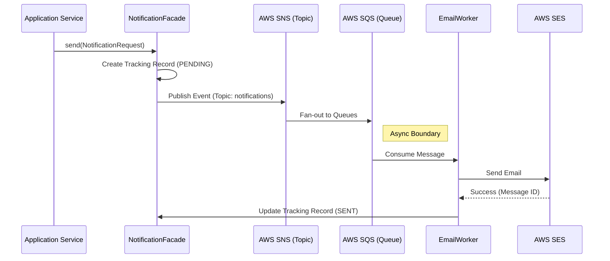

# 06 - Notification System

> **Event-Driven Dispatch Architecture**

The Notification System is designed to be **Asynchronous** and **Reliable**. We do not send emails directly from the HTTP Request thread. Instead, we use a "Publish-Subscribe" model.

---

## Architecture Flow

### System Walkthrough
1.  **App Request**: The main application wants to send an email (e.g., "Welcome to Horaion"). It calls the `NotificationFacade`.
2.  **Fast Path (Synchronous)**: The Facade does minimal work. It saves a `PENDING` record to the DB and fires an event to AWS SNS. It then returns immediately. This keeps the user interface snappy.
3.  **Slow Path (Asynchronous)**:
    *   **SNS -> SQS**: AWS routes the message to a Queue.
    *   **Worker**: A background worker picks up the message. This happens independently of the user's request.
    *   **Delivery**: The worker calls AWS SES to actually send the email.
    *   **Confirmation**: Once sent, the worker updates the database record to `SENT`. If SES fails, it marks it as `FAILED`, allowing for retries or manual investigation.

---

## 1. Notification Facade
**File**: [`NotificationFacade.java`](file:///home/moses/genesis/api_app/horaion/src/main/java/com/horaion/app/shared/infrastructure/notification/services/NotificationFacade.java)

This is the **Entry Point** for sending any notification (Email, SMS, Webhook).

### How it works
1.  **Correlation ID**: Generates a unique ID to track this specific request across the entire distributed system.
2.  **Tracking**: Immediately saves a record to the database with status `PENDING`.
3.  **Publish**: Serializes the request and sends it to an **SNS Topic**.


**Success:** This approach ensures the HTTP request returns almost instantly (`CompletableFuture`), improving perceived performance for the user.


---

## 2. Workers
**File**: [`EmailNotificationWorker.java`](file:///home/moses/genesis/api_app/horaion/src/main/java/com/horaion/app/shared/infrastructure/notification/workers/EmailNotificationWorker.java)

Workers listen to **SQS Queues** that are subscribed to the SNS Topic.

### Reliability Features
*   **Manual Acknowledgement**: The worker only tells SQS "I'm done" (`ack.acknowledge()`) *after* the email is successfully sent. If the worker crashes mid-process, the message returns to the queue to be retried.
*   **Filtering**: The worker checks `Type == EMAIL`. If not, it ignores the message (allowing other workers, like SMS workers, to pick it up).


**Warning:** Ensure your Queue Visibility Timeout is longer than the time it takes to send an email (default 30s), otherwise you risk processing the same email twice.

