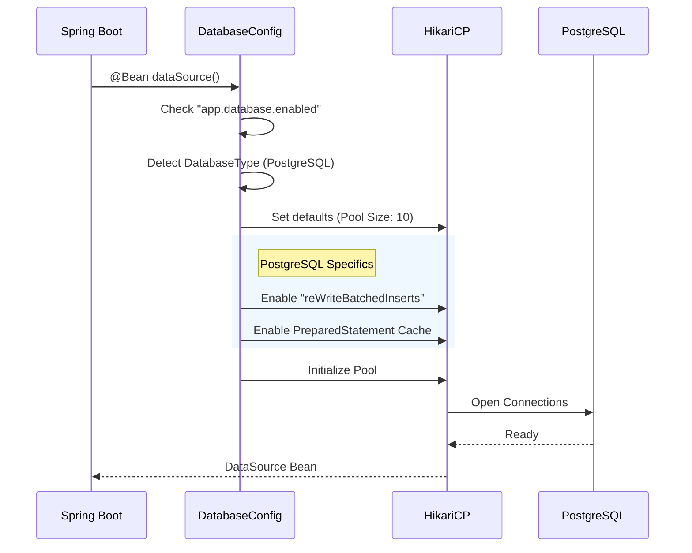

# 01 - Database Configurations

> **Robust Data Access Layer Setup**

Establishing a reliable connection to the database is the most critical part of the application startup. We use **HikariCP**, the fastest connection pool available for Java, configured with production-grade defaults.

---

## 1. Database Configuration
**File**: ``DatabaseConfiguration.java``

This configuration does far more than just reading the `url` and `password`. It intelligently optimizes the connection pool based on the **Database Type** (PostgreSQL vs H2).

### Initialization Flow



> **Diagram Explanation**: The database initialization is an intelligent, multi-step process:
> 1.  **Bean Discovery**: Spring Boot discovers the `@Bean` definition and begins instantiation.
> 2.  **Detection**: The system explicitly checks the JDBC URL to determine if special optimizations (like Postgres batching) should be enabled.
> 3.  **Tuning**: HikariCP is configured with the production pool size (default 10) and performance flags.
> 4.  **Connection Warmup**: The pool opens physical connections immediately to avoid late-latency during the first user request.


**Performance Win:** By enabling `reWriteBatchedInserts` automatically for PostgreSQL, we ensure that bulk data imports (like Employee CSV uploads) are 3-5x faster than a default Spring Boot configuration.


### Initialization Steps
1.  **Bean Creation**: Spring Boot calls the `dataSource()` method during startup.
2.  **Detection**: We parse the JDBC URL (`jdbc:postgresql:...`) to determine we are connecting to **PostgreSQL**.
3.  **Optimization**: Instead of just using defaults, we inject Postgres-specific flags.
    *   `reWriteBatchedInserts`: This is a massive performance booster. It takes individual SQL inserts (`INSERT INTO...`) and rewrites them into a single multi-row insert statement before sending bytes over the network.
4.  **Pool Startup**: Only after configuring these performance settings do we start the Hikari Pool, which opens physical TCP connections to the database.

### Key Features
1.  **Auto-Detection**: You don't need to specify the `driverClassName`. We detect it automatically from the JDBC URL (`jdbc:postgresql:...` -> `org.postgresql.Driver`).
2.  **Smart Optimizations**:
    *   **PostgreSQL**: Enables server-side prepared statements and batched inserts for 5-10x performance gain in bulk operations.
    *   **H2 (Test)**: Disables "Close on Exit" to prevent tests from flaking during shutdown.
3.  **Observability**: Automatically registers **Micrometer Metrics**. You can see `hikaricp.connections.active` in Prometheus/Grafana without adding any extra code.
4.  **Security**: Logs the database configuration on startup but **masks** the password in the JDBC URL (`jdbc:postgresql://host:5432/db?password=***`).

---

## 2. Conditional Activation
The entire database layer can be disabled by setting:
```yaml
app:
  database:
    enabled: false
```
This is useful for lightweight services (like a pure calculation engine) that don't need persistent storage.
