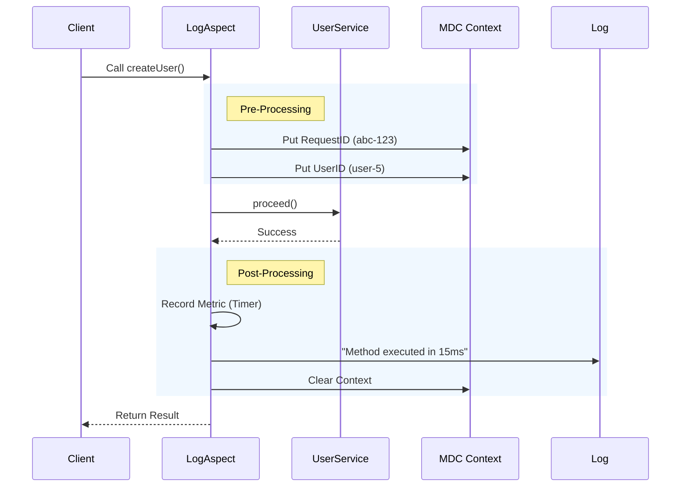

# 01 - Logging Aspects

> **Automated Observability via AOP**

In a large application, adding `log.info(...)` to the start and end of every method is tedious and creates noise. We use **Aspect Oriented Programming (AOP)** to automatically inject logging, tracing, and metrics into every Service and Controller.

---

## 1. The Log Aspect
**File**: ``LogAspect.java``

This class intercepts method calls to provide "Three Pillars of Observability" automatically:

1.  **Logging**: "Who called what, and did it succeed?"
2.  **Tracing**: "Which specific request was this?" (Correlation ID).
3.  **Metrics**: "How long did it take?" (Micrometer).

### Visual Layout



> **Diagram Explanation**: This sequence visualization shows the "Around Advice" pattern for automated observability:
> 1.  **Correlation ID**: The `LogAspect` intercepts the call and injects a unique Request ID into the SLF4J MDC. This ID follows the request across all log lines on that thread.
> 2.  **Telemetry Phase**: Before the target method runs, the system records the start time.
> 3.  **Encapsulation**: The target method (`createUser`) runs within a try-catch-finally block, ensuring metrics are recorded and MDC is cleared even if an error occurs.
> 4.  **Reporting**: After successful execution, the aspect logs the duration and pushes a timer metric to the Micrometer registry.

### How to Read This Diagram
This **Sequence Diagram** visualizes the "Around" advice pattern used by AOP.
1.  **Intercept**: The `AOP` (LogAspect) sits between the `Client` and the `Service`. The client thinks it's calling the service directly, but it's actually calling the proxy.
2.  **Pre-Processing**: Before the code runs, we populate the **MDC** (Mapped Diagnostic Context). This ensures every log line printed during execution has a `RequestID`.
3.  **Execution**: `proceed()` allows the actual code to run.
4.  **Post-Processing**: After the code returns, we stop the timer and look at the result. If it threw an exception, we log an error. If it succeeded, we log success.
5.  **Context Cleanup**: Crucially, we clear the MDC to prevent memory leaks or "pollution" where one request sees another's ID on a shared thread.

---

### Key Features

#### Mapped Diagnostic Context (MDC)
The aspect automatically populates the **SLF4J MDC**. This means *every single log line* printed by the application (even buried deep in utility classes) will automatically include:
*   `requestId`: Unique ID for the HTTP request.
*   `userId`: The currently authenticated user.
*   `method`: Experiencing performance issues? Filter logs by method name.


**Note**: This is crucial for debugging in production. You can search Splunk/Kibana for `requestId="abc-123"` and see the entire lifecycle of that request across all layers.


#### Slow Query Detection
If a method takes longer than the configured threshold (default 1000ms), it logs a **WARN** instead of INFO. This helps proactively identify performance bottlenecks.

```java
// Logic inside LogAspect
if (durationMs >= properties.slowExecutionThresholdMs()) {
    LOGGER.warn("Method {} executed slowly in {} ms", ...);
}
```

---

## 2. Targets (`@Pointcut`)
The Aspect is configured to automatically wrap:
1.  **Services**: Execution of any public method in `com.horaion.app..services..*`.
2.  **Controllers**: Any method within a `@RestController`.


**Tip:** You don't need to add any annotations (`@Loggable`) to your services. It works out of the box.

