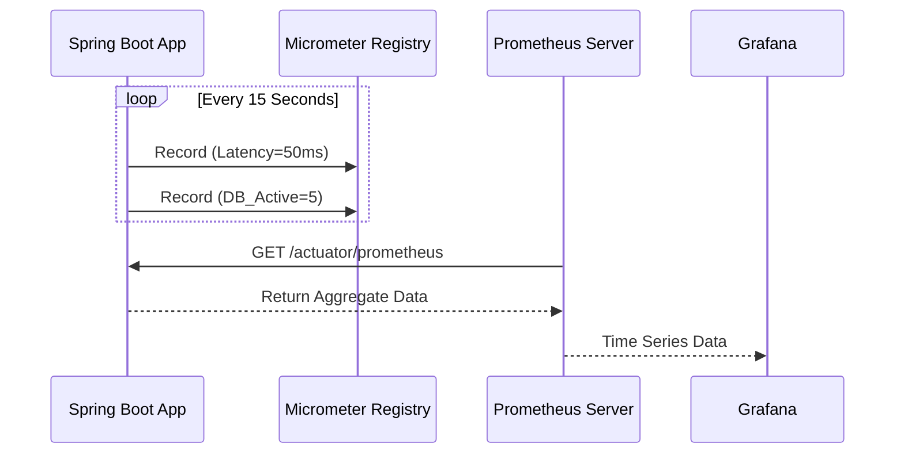

# 01 - Metrics Configuration

> **Operational Insight & Telemetry**

While **Logging** tells you *why* something happened, **Metrics** tell you *what* is happening right now (throughput, latency, error rates). We use **Micrometer** as a vendor-neutral facade, configured to export data to **Prometheus**.

---

## 1. Architecture
The application does not "push" metrics to a server. Instead, it exposes an endpoint (`/actuator/prometheus`) that the monitoring system "scrapes" periodically.



> **Diagram Explanation**: The Horaion monitoring stack uses a "Pull-Based" telemetry model:
> 1.  **Metric Buffet**: The application continuously aggregates performance data (JMV, HTTP, SQL) in its local memory.
> 2.  **Scrape Interface**: The `/actuator/prometheus` endpoint serves this data in a specialized text format optimized for Prometheus.
> 3.  **Persistence**: The Prometheus server periodically polls the application, ensuring that monitoring traffic is controlled by the monitoring server, not the application itself.
> 4.  **Dashboards**: Grafana queries Prometheus using PromQL to build high-fidelity, real-time visualizations of system health.


**Design Choice:** We use the local Pull model instead of a Push model to prevent the application from being overwhelmed by its own monitoring traffic during heavy load or network congestion.


### Visual Walkthrough
1.  **Instrumentation**: Code (like `LogAspect`) records events into the `Micrometer Registry`. This happens in memory and is extremely fast.
2.  **Scraping**: Prometheus contacts the application on a schedule.
3.  **Visualization**: SREs viewing Grafana dashboards consume the data stored in Prometheus.

---

## 2. Configuration Class
**File**: ``MetricsConfiguration.java``

Currently, this class is a **placeholder** for future customizations.

### Why is it empty?
Spring Boot's **Auto-Configuration** (`MicrometerMetricsAutoConfiguration`) handles 90% of the work for us. It automatically detects `micrometer-registry-prometheus` on the classpath and configures the `MeterRegistry` Bean.

### What belongs here?
If we need to add global tags (like `region=us-east-1` or `env=production`) to *every* metric, we would define a `MeterRegistryCustomizer` here.

```java
// Future Implementation Example
@Bean
MeterRegistryCustomizer<MeterRegistry> metricsCommonTags() {
    return registry -> registry.config().commonTags("application", "horaion");
}
```

---

## 3. Standard Metrics
Without writing any code, we get the following out of the box:
*   **JVM**: Memory usage, Garbage Collection pauses, Thread counts.
*   **Tomcat**: Active sessions, request throughput.
*   **HikariCP**: Active connections, wait times (Configured in `DatabaseConfiguration`).
*   **Logback**: Number of ERROR logs generated.


**Tip:** You can check the currently exposed metrics by hitting the `/actuator/metrics` endpoint locally.


---

## 4. How to Add Custom Metrics
To track your own business logic (e.g., "Salary Calculated Count"), inject `MeterRegistry`.

### Example: Counter
Use a **Counter** for values that only go up (events, total requests).

```java
@Service
public class SalaryService {
    private final Counter salaryCalculationCounter;

    public SalaryService(MeterRegistry registry) {
        // 1. Register the metric once in the constructor
        this.salaryCalculationCounter = registry.counter("business.salary.calculations");
    }

    public void calculate() {
        // 2. Increment it where needed
        salaryCalculationCounter.increment();
        // logic...
    }
}
```

### Example: Timer
Use a **Timer** to measure short-duration latencies.

```java
Timer.builder("business.salary.time")
    .description("Time taken to calculate salary")
    .register(registry)
    .record(() -> {
        // logic that takes time...
    });
```
