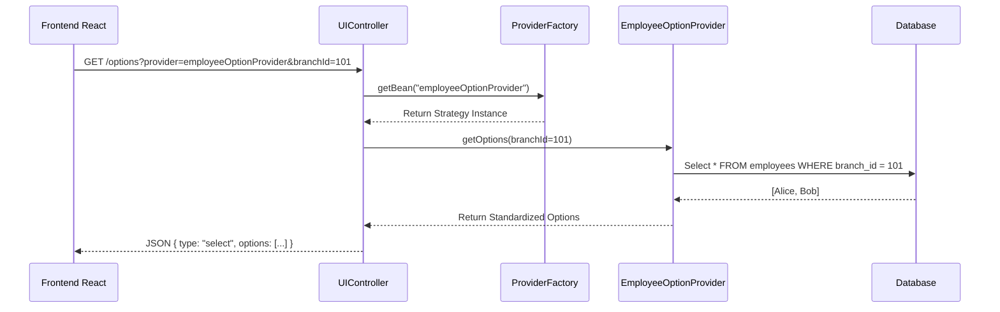

# 01 - Providers Overview

> **Dynamic UI Configuration Strategy**

In a complex enterprise application, hardcoding dropdown options (like "Shift Types" or "Role Lists") in the Frontend code is a maintenance nightmare.
The **Providers** package implements a **Strategy Pattern** to allow the Backend to dynamically drive UI options based on the user's context (Branch, Company, etc.).

---

## Architecture Flow
Instead of the Frontend asking "Get me all employees", it asks for "Options for Field X". The Backend resolves the correct strategy to fulfill this request.

### Visual Walkthrough
1.  **Request**: The Frontend component (e.g., a "Assign Manager" dropdown) knows it needs data from `employeeOptionProvider`.
2.  **Resolution**: The Backend does not have a giant `if/else` block. It uses Spring's `ApplicationContext` to look up the bean by name.
3.  **Context**: The provider receives context (Branch ID) to filter the results relevant to the user.
4.  **Standardization**: The response is always a standardized JSON structure (Label/Value pairs), so the Frontend component can be generic and reusable.

---

## Key Benefits
*   **Decoupling**: The Frontend doesn't need to know *how* to fetch employees or roles. It just asks for the options.
*   **Reusability**: Different pages can reuse the same provider logic.
*   **Dynamic filtering**: Providers can enforce security rules (e.g., "Only show employees I manage") on the server side.
