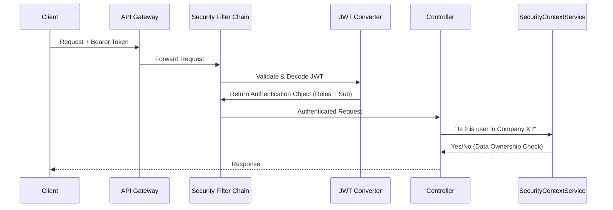

# 01 - Security Overview

> **Defense in Depth Strategy**

The application employs a multi-layered security model. We separate **Identity** (Cognito), **Access Control** (Spring Security), and **Policy Enforcement** (Permit.io).

---

## 1. High-Level Architecture

> **Diagram Explanation**: Every request undergoes a rigorous multi-stage security validation:
> 1.  **Transport Security**: The request arrives at the Gateway via HTTPS with an encrypted Bearer Token.
> 2.  **JWT Verification**: The Spring Security Filter Chain delegates to the `JWT Converter` to verify the cryptographic signature against AWS's public keys.
> 3.  **Context Conversion**: If valid, the user's Cognito identity is converted into a structured `Authentication` object including their roles.
> 4.  **Local Check**: The `SecurityContextService` performs a secondary "Logical Guard" check to ensure the authenticated user actually has permission to access the requested Company/Branch data (Data-level security).


**Critical:** CSRF protection is disabled (`.csrf().disable()`) because the API is stateless and uses Bearer tokens rather than cookies. Do not enable CSRF without first implementing a robust cookie-based strategy.


### Visual Walkthrough
1.  **Authentication**: Handled by AWS Cognito. The app receives a `Bearer <JWT>`.
2.  **Validation**: `SecurityConfiguration` sets up the `OAuth2ResourceServer`. The token fingerprint is checked against the Cognito keyset (JWK).
3.  **Conversion**: `CognitoJwtAuthenticationConverter` maps Cognito Groups (e.g., `system-administrator`) to Spring Roles (`ROLE_SYSTEM_ADMINISTRATOR`).
4.  **Authorization**:
    *   **Method Security**: `@PreAuthorize("hasRole(...)")` checks the Spring Role.
    *   **Data Security**: `SecurityContextService` ensures a user only touches their own company's data.
    *   **Policy Security**: `PermitAuthorizationService` checks granular permissions (ABAC).

---

## 2. Key Components

| Component | Purpose |
| :--- | :--- |
| **`SecurityConfiguration`** | The main firewall. Configures CORS, CSRF (Disabled), and Public Endpoints. |
| **`SecurityContextService`** | The "Data Owner" guard. Enforces rules like "Users can only see *their own* profile". |
| **`PermitAuthorizationService`** | The "Policy" guard. Integrates with Permit.io for fine-grained permissions. |
| **`AuthorizationHelper`** | Static utility for easy access to the current user (e.g., `getUserSub()`). |


**Note:** We use **Stateless Session Management**. No sessions are stored on the server; the JWT is the single source of truth for identity.


### 2.1 Public Endpoints

The following endpoints are intentionally excluded from the security filter chain:

*   `/actuator/health` (Health Checks)
*   `/auth/login` (Initial Login)
*   `/public/**` (Public Assets)


**Tip:** Token invalidation is handled by the client. Upon logout, the client should discard the tokens. For server-side revocation, use the `globalSignOut` method provided in the `CognitoService`.


### 2.2 Role Mapping

Cognito User Pool Groups are mapped to Spring Security roles as follows:

| Cognito Group | Spring Security Role | `RoleConstant` |
| :------------ | :------------------- | :------------- |
| `system-admin` | `ROLE_SYSTEM_ADMIN` | `RoleConstant.ROLE_SYSTEM_ADMIN` |
| `company-owner` | `ROLE_COMPANY_OWNER` | `RoleConstant.ROLE_COMPANY_OWNER` |
| `user` | `ROLE_USER` | `RoleConstant.ROLE_USER` |


**Note:** The `ROLE_` prefix is a mandatory Spring Security convention. All security checks (e.g., `@PreAuthorize("hasRole('ADMIN')")`) omit the prefix internally but require it to exist in the authority list.



**Important:** If a user is in multiple groups, the application logic (via `AuthorizationHelper`) determines a **Primary Role** based on precedence (Admin > Owner > User).

