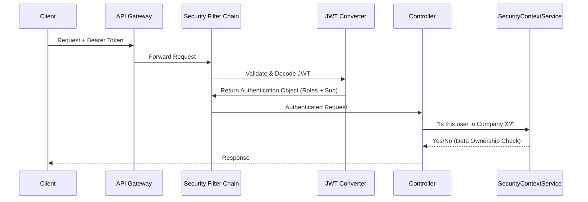

# 01 - Security Overview

> **Defense in Depth Strategy**

The application employs a multi-layered security model. We separate **Identity** (Cognito), **Access Control** (Spring Security), and **Policy Enforcement** (Permit.io).

---

## 1. High-Level Architecture

### Visual Walkthrough
1.  **Authentication**: Handled by AWS Cognito. The app receives a `Bearer <JWT>`.
2.  **Validation**: `SecurityConfiguration` sets up the `OAuth2ResourceServer`. The token fingerprint is checked against the Cognito keyset (JWK).
3.  **Conversion**: `CognitoJwtAuthenticationConverter` maps Cognito Groups (e.g., `system-administrator`) to Spring Roles (`ROLE_SYSTEM_ADMINISTRATOR`).
4.  **Authorization**:
    *   **Method Security**: `@PreAuthorize("hasRole(...)")` checks the Spring Role.
    *   **Data Security**: `SecurityContextService` ensures a user only touches their own company's data.
    *   **Policy Security**: `PermitAuthorizationService` checks granular permissions (ABAC).

---

## 2. Key Components

| Component | Purpose |
| :--- | :--- |
| **`SecurityConfiguration`** | The main firewall. Configures CORS, CSRF (Disabled), and Public Endpoints. |
| **`SecurityContextService`** | The "Data Owner" guard. Enforces rules like "Users can only see *their own* profile". |
| **`PermitAuthorizationService`** | The "Policy" guard. Integrates with Permit.io for fine-grained permissions. |
| **`AuthorizationHelper`** | Static utility for easy access to the current user (e.g., `getUserSub()`). |


**Note:** We use **Stateless Session Management**. No sessions are stored on the server; the JWT is the single source of truth for identity.

